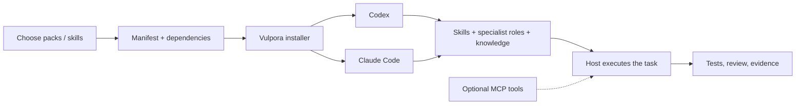

<p align="center">
  
</p>

# Vulpora

[English](README.md) · [한국어](README.ko.md)

**Specialists in sync.**

Vulpora gives **Codex and Claude Code** reusable specialist roles, task workflows, and reference knowledge.
Install the capabilities your project needs, invoke a skill, and carry work through implementation,
review, and verification in your existing coding runtime.

**14 packs · 28 agents · 62 skill entries · macOS / Linux · Apache-2.0**

The fox and its many tails represent distinct specialties working toward one goal.
The package, command, and project namespace are **`vulpora`**. [Name and artwork](docs/naming.md).

[Quick start](#quick-start) · [Usage](#use-a-skill) · [Packs](#choose-a-pack) · [Skills](#skill-catalog) · [Architecture](#how-it-fits-together) · [Docs](#documentation)

## What you can do

| Your task | Start here |
|---|---|
| Understand a repository and implement a change | `core` → `vulpora-init`, `code-authoring-router` |
| Coordinate a task with several steps | `orchestration` → `start-task` |
| Plan a product, design UX, or review a UI | `product` → planner, designer, reviewer, `product-ui-design` |
| Write or review Kotlin / Java / Spring code | `jvm-spring` and `jvm-quality` |
| Work on SQL, schemas, or search | `postgres`, `mssql`, or `opensearch` |
| Build tests, run E2E, or publish a report | `qa-e2e`, test workflows, and `visual` |

Packs include declared dependencies. Shared assets are installed once. `doctor` checks the installation;
receipt-based removal preserves files you changed. Installing the npm package alone does not install
agents, connect services, or start a model task.

## Quick start

Requires **macOS/Linux, Bash 3.2+, Git, Node.js 18.18+ and npm**, plus the Codex or Claude Code CLI.
Optional skills may need more tools; see the [skill prerequisites](docs/skills.en.md).

### 1. Open the installer

The npm registry release is **pending**. Run the current repository version:

```sh
npx --yes --package='git+https://github.com/ch4570/vulpora.git' -- vulpora
```

This follows the default branch and requires access to the repository. The installer detects your
runtimes, offers project/user scope and capability selection, then previews changes before applying them.
In the skill picker, start with **`vulpora-init`** and **`code-authoring-router`**. To select a complete
pack, use `./vulpora setup --runtime codex --scope project --target /absolute/project pack:core`
from a checkout. Already cloned the repository? Run `./vulpora` to open the installer.

<details>
<summary>Versioned npm release command — available after publication</summary>

```sh
npx --yes vulpora@1.0.0
```

After publication, use `npm install --global vulpora@1.0.0` for a persistent command.
Until then, use the Git command above or a reviewed tarball from the [installation guide](INSTALL.md).

</details>

### 2. Initialize your project

Restart your runtime after installation. In the project you want to work on, send the appropriate prompt:

| Codex | Claude Code |
|---|---|
| `$vulpora-init` | `/vulpora-init` |

This inspects your stack and updates the managed routing section of `AGENTS.md`, preserving handwritten
instructions.

### 3. Ask for work

Install `pack:orchestration` to use this workflow. These are **runtime prompts**, not shell commands:

```text
Codex       $start-task "Add a retry limit and regression tests"
Claude Code /start-task "Add a retry limit and regression tests"
```

`start-task` selects a lightweight direct path, standard coordination, or an audit workflow based on
the task. An explicit profile is a leading token: `$start-task --audit "Review this migration plan"`.
[Orchestration contract](docs/start-task-orchestration.md).

## Keep orchestration context small

Standard tasks can delegate independent lanes to a **fresh Codex session**. Send a bounded task capsule with
selected paths and acceptance checks; collect a compact candidate result and runtime token usage. The parent
reviews the diff and evidence. Small or coupled changes stay with one owner.

Task type, difficulty, risk, the available model catalog, and budget select a model profile: simple inspection
uses the frugal tier, ordinary implementation uses standard, and complex/high-risk work uses frontier.
Deterministic checks use no model. The default candidates are Luna, Terra, and Astra respectively; availability
and an explicit operator policy control the actual route.

```sh
./vulpora models --runtime codex > /absolute/runtime-models.json
./vulpora session prepare --task /absolute/task.json --catalog /absolute/runtime-models.json --out /absolute/attempt-001
./vulpora session run --capsule /absolute/attempt-001/capsule.json
./vulpora session status --capsule /absolute/attempt-001/capsule.json
```

See the [task JSON and session limits](skills/start-task/reference/kb/independent-sessions.md) and
[token measurements](evals/token-efficiency/README.md). New sessions do not inherit the parent transcript;
their startup and rereads still cost tokens. Claude session execution is not yet implemented; explicit audits
retain their native evidence contract.

## Use a skill

**Install in the terminal; invoke inside the runtime.** From a source checkout, replace the target with
an existing project directory:

```sh
# Preview → install → verify a workflow and its dependencies.
./vulpora setup --runtime codex --scope project --target /absolute/project --dry-run postgres-review-workflow
./vulpora setup --runtime codex --scope project --target /absolute/project postgres-review-workflow
./vulpora doctor --runtime codex --scope project --target /absolute/project postgres-review-workflow
```

Then send `$postgres-review-workflow "Review the changed SQL and migration"` in Codex.
For Claude Code, install with `--runtime claude-code` and use `/postgres-review-workflow` in its prompt.
Marketplace installations may expose namespaced commands; choose the command shown by your runtime.

| Need | Codex prompt example |
|---|---|
| Implement using project conventions | `$code-authoring-router "Add cursor pagination to the search API"` |
| Review backend changes | `$backend-code-review-workflow "Review the current diff"` |
| Design an interface | `$product-ui-design "Design the empty, loading, and error states for this dashboard"` |
| Improve existing tests | `$test-quality-refactoring-workflow "Review and strengthen the order service tests"` |
| Run an existing E2E catalog | `$e2e-test-workflow "Run checkout scenarios in the configured test environment"` |
| Explain code visually | `$code-diagram-extract "Trace the request-to-database path for this endpoint"` |

Install the named skill before invoking it. For direct Claude Code installations, replace the leading
`$` with `/`. Task descriptions are examples, not extra CLI flags; each skill's prerequisites still apply.

**[All skills, purposes, invocation examples, and prerequisites →](docs/skills.en.md)**

## CLI reference

These terminal commands use a source checkout. With a global installation, omit `./`.

| Command | Purpose |
|---|---|
| `./vulpora` | Open the guided installer |
| `./vulpora list` | List packs and assets |
| `./vulpora setup --runtime codex --scope project --target /absolute/project pack:core` | Install a pack and dependencies |
| `./vulpora doctor --runtime codex --scope project --target /absolute/project pack:core` | Verify installation |
| `./vulpora uninstall --runtime codex --scope project --target /absolute/project --dry-run pack:core` | Preview removal |
| `./vulpora uninstall --runtime codex --scope project --target /absolute/project pack:core` | Remove eligible receipt-owned files |
| `./vulpora mcp list` | List separately managed hosted MCP connections |
| `./vulpora version` | Show the source version |

Use `--scope user` and omit `--target` to share an installation across projects. Omitting `--runtime` targets all detected
Codex/Claude Code runtimes. Noninteractive `setup` applies changes; use `--dry-run` for a preview.
[Full installation and removal reference](INSTALL.md).

## Choose a pack

| Pack | Contents and purpose |
|---|---|
| `core` | Project initialization and implementation routing |
| `product` | Product planning, UX design, design review, UI workflow |
| `orchestration` | Task clarification, decomposition, coordination, completion |
| `jvm-spring` | Kotlin/Java/Spring authoring, review, tests |
| `jvm-spring-postgres-opinionated` | Optional JPA, layered Spring, Flyway conventions |
| `postgres` | PostgreSQL authoring and integrated review |
| `mssql` | Version-aware T-SQL and SQL Server migrations |
| `opensearch` | Query DSL, mappings, optimization, review |
| `jvm-quality` | Architecture/backend review and test-quality refactoring |
| `qa-e2e` | QA scenario design and API/browser E2E workflows |
| `visual` | Product UI, diagrams, document publishing, visual QA |
| `product-discovery-ko` | Korean requirements dialogue and product artifacts |
| `knowledge` | Evaluation, knowledge audit, learning, skill maintenance |
| `notion` | Notion context; researcher agent and MCP setup are prerequisites |

Mix packs: `./vulpora setup --runtime codex --scope project --target /absolute/project pack:core pack:postgres`.
The [pack registry](install/packs.txt) and [manifest](install/manifest.txt) define exact roots and dependencies.
The [agent catalog](docs/catalog-guide.md#agent-catalog) lists all 28 specialist roles.

## Skill catalog

The manifest has **62 skill entries**. `codex-agent-runtime` is a disabled compatibility entry;
the handbook marks it explicitly instead of suggesting it as an execution path.

<!-- SKILL_SUMMARY_START -->
<details>
<summary>Browse all 62 skill entries by category</summary>

| Area | Skills |
|---|---|
| Installation, routing, and task entry · 5 | [vulpora-init](skills/vulpora-init/SKILL.md), [vulpora-installer](skills/vulpora-installer/SKILL.md), [code-authoring-router](skills/code-authoring-router/SKILL.md), [start-task](skills/start-task/SKILL.md), [codex-agent-runtime](skills/codex-agent-runtime/SKILL.md) |
| Product requirements and UI · 2 | [product-requirements](skills/product-requirements/SKILL.md), [product-ui-design](skills/product-ui-design/SKILL.md) |
| Kotlin and Spring authoring · 10 | [kotlin-code-authoring](skills/kotlin-code-authoring/SKILL.md), [entity](skills/entity/SKILL.md), [enum](skills/enum/SKILL.md), [mapper](skills/mapper/SKILL.md), [repository](skills/repository/SKILL.md), [request](skills/request/SKILL.md), [response](skills/response/SKILL.md), [service](skills/service/SKILL.md), [flyway](skills/flyway/SKILL.md), [test-authoring](skills/test-authoring/SKILL.md) |
| Code, design, and test quality review · 11 | [architecture-review-workflow](skills/architecture-review-workflow/SKILL.md), [backend-code-review-workflow](skills/backend-code-review-workflow/SKILL.md), [java-spring-review-workflow](skills/java-spring-review-workflow/SKILL.md), [kotlin-spring-review-workflow](skills/kotlin-spring-review-workflow/SKILL.md), [kotlin-spring-review](skills/kotlin-spring-review/SKILL.md), [oop-design-review](skills/oop-design-review/SKILL.md), [design-pattern-apply](skills/design-pattern-apply/SKILL.md), [refactoring-catalog](skills/refactoring-catalog/SKILL.md), [test-quality-review](skills/test-quality-review/SKILL.md), [test-refactoring](skills/test-refactoring/SKILL.md), [test-quality-refactoring-workflow](skills/test-quality-refactoring-workflow/SKILL.md) |
| Databases and search · 12 | [postgres-code-authoring](skills/postgres-code-authoring/SKILL.md), [postgres-query-review](skills/postgres-query-review/SKILL.md), [postgres-schema-design](skills/postgres-schema-design/SKILL.md), [postgres-risk-check](skills/postgres-risk-check/SKILL.md), [postgres-review-workflow](skills/postgres-review-workflow/SKILL.md), [mssql-code-authoring](skills/mssql-code-authoring/SKILL.md), [opensearch-code-authoring](skills/opensearch-code-authoring/SKILL.md), [opensearch-query-review](skills/opensearch-query-review/SKILL.md), [opensearch-schema-review](skills/opensearch-schema-review/SKILL.md), [opensearch-optimization](skills/opensearch-optimization/SKILL.md), [opensearch-review-workflow](skills/opensearch-review-workflow/SKILL.md), [nl-sql-query](skills/nl-sql-query/SKILL.md) |
| QA and E2E · 5 | [e2e-scenario-author](skills/e2e-scenario-author/SKILL.md), [e2e-runner](skills/e2e-runner/SKILL.md), [playwright-e2e](skills/playwright-e2e/SKILL.md), [e2e-report-renderer](skills/e2e-report-renderer/SKILL.md), [e2e-test-workflow](skills/e2e-test-workflow/SKILL.md) |
| Documents, diagrams, and visual artifacts · 9 | [code-diagram-extract](skills/code-diagram-extract/SKILL.md), [schema-doc-extract](skills/schema-doc-extract/SKILL.md), [mermaid-diagrams](skills/mermaid-diagrams/SKILL.md), [diagram-styler](skills/diagram-styler/SKILL.md), [document-designer](skills/document-designer/SKILL.md), [markdown-publisher](skills/markdown-publisher/SKILL.md), [pdf-qa](skills/pdf-qa/SKILL.md), [visual-artifact-router](skills/visual-artifact-router/SKILL.md), [korean-dev-writer](skills/korean-dev-writer/SKILL.md) |
| Evaluation, knowledge, retrospectives, and collaboration · 8 | [agent-eval](skills/agent-eval/SKILL.md), [skill-updater](skills/skill-updater/SKILL.md), [learn](skills/learn/SKILL.md), [retro](skills/retro/SKILL.md), [knowledge-audit](skills/knowledge-audit/SKILL.md), [harness-propose](skills/harness-propose/SKILL.md), [git-flow](skills/git-flow/SKILL.md), [notion-domain-context](skills/notion-domain-context/SKILL.md) |

</details>
<!-- SKILL_SUMMARY_END -->

**[English skill handbook](docs/skills.en.md)** · **[한국어 스킬 사용 가이드](docs/skills.ko.md)**

Each handbook covers every skill's purpose, installation, and example prompt. Optional GitLab, Notion,
DB, browser, and document tools are configured separately.

## How it fits together



**Agents** define roles and authority. **Skills** define procedures. **Bundles** supply reference knowledge.
**Packs** group assets for installation. **MCP** connects separately configured tools.
The coding runtime executes work; the installer manages the catalog and its lifecycle.

```text
vulpora/                  # Current GitHub repository path
├── vulpora                 # Public CLI entry
├── agents/                 # 28 role definitions, adapters, knowledge bundles
├── skills/                 # 62 SKILL.md entries, scripts, references
├── install/                # Manifest, packs, installer, receipts, checks
├── .claude-plugin/         # Claude Code marketplace compatibility
├── mcp/nl-sql/             # Separately built database MCP server
├── templates/              # Project policies, hooks, script templates
├── memory/                 # Memory contracts and reference material
├── evals/                  # Structural and behavioral evaluation harnesses
└── docs/                   # Bilingual guides, architecture, branding, evidence
```

**[Architecture and folder guide →](docs/architecture.en.md)**

## Model routing and support

Model routing compares an explicit policy with models exposed by the runtime. From a checkout:

```sh
./vulpora models --runtime codex > runtime-models.json
./vulpora route --runtime codex --profile standard --catalog runtime-models.json
```

`frugal`, `standard`, and `frontier` select policy candidates; unavailable or stale catalogs block
resolution. A route is a plan (`execution: NOT_RUN`), not proof that a child agent ran. The host must
dispatch and observe execution. [Routing details](docs/review-workflow-model-routing.md).

| Runtime | Current support |
|---|---|
| Codex | Project/user installation, native adapters, verification, removal |
| Claude Code | Project/user installation and repository marketplace plugin |
| OpenCode | Experimental project rendering through the low-level installer |

Offline tests validate contracts and installation behavior. Real model execution, service authentication,
browser rendering, and DB integration need their own environment and evidence.
[Evaluation boundaries](docs/eval-trust-boundaries.md).

## Documentation

| Guide | English | 한국어 |
|---|---|---|
| Overview and quick start | [README](README.md) | [README.ko.md](README.ko.md) |
| All skills and usage | [Skill handbook](docs/skills.en.md) | [스킬 사용 가이드](docs/skills.ko.md) |
| Architecture and folders | [Architecture](docs/architecture.en.md) | [아키텍처](docs/architecture.ko.md) |
| Token measurement and design | [Token efficiency](evals/token-efficiency/README.md) | [토큰 효율성](evals/token-efficiency/README.ko.md) |

Also see [installation](INSTALL.md), [full documentation](docs/README.md), [product pack](docs/product-pack.md),
[name and artwork](docs/naming.md), and [changelog](CHANGELOG.md).

## Contributing

V1 uses `vulpora-init`, `VULPORA_*` environment variables, `vulpora.config.json`, `.vulpora` state,
and the Claude plugin ID `vulpora@vulpora`. [Project identifiers](docs/naming.md#project-identifiers).

The audit workflow retains its `vulpora.start-task/v1` contract; ordinary tasks use the lighter
profile described in the [orchestration guide](docs/start-task-orchestration.md).

```sh
npm run check         # Offline source contracts during development
npm test              # Isolated package installation/removal integration
npm run test:routing   # Routing and execution-evidence contracts; no model turns
```

Read [CONTRIBUTING](CONTRIBUTING.md) to extend the catalog and [SECURITY](SECURITY.md) for private reports.
Licensed under [Apache-2.0](LICENSE); preserve the attribution in [NOTICE](NOTICE).
