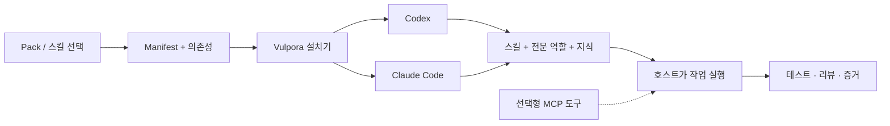

<p align="center">
  
</p>

# Vulpora · 벌포라

[English](README.md) · [한국어](README.ko.md)

**여러 전문성을 하나의 작업으로.**

Vulpora는 **Codex와 Claude Code**에 전문 역할, 작업 스킬, 참고 지식을 설치하는 도구입니다.
프로젝트에 필요한 능력만 선택하고, 기존 코딩 런타임에서 구현·리뷰·검증까지 이어갑니다.

**14개 pack · 28개 에이전트 · 63개 스킬 항목 · macOS / Linux · Apache-2.0**

여러 꼬리가 하나의 몸으로 움직이는 여우에 서로 다른 전문성의 협업을 담았습니다.
npm 패키지·명령어·프로젝트 네임스페이스는 **`vulpora`**입니다. [이름과 이미지](docs/naming.md).

[빠른 시작](#빠른-시작) · [사용법](#스킬-사용법) · [Pack](#pack-고르기) · [전체 스킬](#스킬-카탈로그) · [구조](#아키텍처와-폴더-구조) · [문서](#문서-찾기)

## 어떤 일을 할 수 있나요?

| 하고 싶은 일 | 시작점 |
|---|---|
| 저장소를 파악하고 기능 구현하기 | `core` → `vulpora-init`, `code-authoring-router` |
| 여러 단계의 작업을 조율하기 | `orchestration` → `start-task` |
| 제품 기획, UX 설계, UI 리뷰 | `product` → 기획자·디자이너·리뷰어, `product-ui-design` |
| Kotlin / Java / Spring 작성·리뷰 | `jvm-spring`, `jvm-quality` |
| SQL·스키마·검색 개선 | `postgres`, `mssql`, `opensearch` |
| 테스트 작성, E2E 실행, 보고서 제작 | `qa-e2e`, 테스트 workflow, `visual` |

Pack을 고르면 선언된 의존성도 함께 설치하며, 공유 자산은 중복 설치하지 않습니다. `doctor`로 설치를
점검하고 설치 기록을 기준으로 제거합니다. 사용자가 수정한 파일은 보존합니다. npm 패키지만 설치해도
에이전트 설치나 외부 서비스 연결, 모델 작업이 자동으로 시작되지는 않습니다.

## 빠른 시작

**macOS/Linux, Bash 3.2+, Git, Node.js 18.18+와 npm**, 사용할 Codex 또는 Claude Code CLI가 필요합니다.
선택한 스킬에 따라 추가 도구가 필요합니다. [스킬별 사전 조건](docs/skills.ko.md)을 확인하세요.

### 1. 설치기 실행

npm registry 게시는 **보류**했습니다. 공개 저장소 버전으로 실행합니다.

```sh
npx --yes --package='git+https://github.com/ch4570/vulpora.git' -- vulpora
```

공개 저장소의 기본 브랜치를 사용합니다. 설치기는 런타임을 자동 감지하고,
프로젝트/사용자 범위와 설치 항목을 선택한 뒤 적용할 변경을 보여줍니다.
스킬 선택 화면에서는 **`vulpora-init`**와 **`code-authoring-router`**로 시작하세요.
Pack 전체를 고르려면 checkout에서 `./vulpora setup --runtime codex --scope project --target /absolute/project pack:core`를
사용합니다. 이미 clone했다면 `./vulpora`로 설치기를 열 수 있습니다.

<details>
<summary>npm 버전 고정 명령 — 공개 배포 완료 후 사용</summary>

```sh
npx --yes vulpora@1.0.1
```

배포 후에는 `npm install --global vulpora@1.0.1`으로 전역 명령을 설치할 수도 있습니다.
그 전에는 위 Git 명령이나 [설치 가이드](INSTALL.md)의 검토된 로컬 tarball을 사용합니다.

</details>

### 2. 작업할 프로젝트 초기화

설치 후 런타임을 재시작합니다. 작업할 프로젝트를 열고 런타임에 맞는 프롬프트를 입력하세요.

| Codex | Claude Code |
|---|---|
| `$vulpora-init` | `/vulpora-init` |

기술 스택을 확인해 `AGENTS.md`의 관리 영역만 갱신하며 기존 수동 지침은 보존합니다.

### 3. 작업 요청

이 workflow를 사용하려면 `start-task` 또는 `pack:orchestration`을 설치합니다. 다음은 셸 명령이 아닌 **런타임 프롬프트**입니다.

```text
Codex       $start-task "검색 API에 재시도 상한과 회귀 테스트를 추가해줘"
Claude Code /start-task "검색 API에 재시도 상한과 회귀 테스트를 추가해줘"
```

작업에 따라 직접 처리하는 `lightweight`, 일반 조율인 `standard`, 증거를 기록하는 `audit` 경로를 선택합니다.
명시하려면 `$start-task --audit "이 마이그레이션 계획을 검토해줘"`처럼 맨 앞에 profile 토큰을 둡니다.
[오케스트레이션 안내](docs/start-task-orchestration.md).

범위가 정해진 코딩 작업에는 작업 진입점과 선언된 의존성만 선택해 설치할 수 있습니다.

```sh
./vulpora setup --runtime codex --scope project --target /absolute/project start-task
```

전체 목록 대신 스킬 3개를 설치합니다. 작은 작업의 지침은 진입 파일에 포함하고, standard·audit
참조는 해당 경로를 선택했을 때 읽습니다. 필요한 도메인 팩은 추가로 설치합니다. 기존 전역 설치의
스킬은 계속 발견되므로 프로젝트 선택 설치만으로 전역 문맥까지 줄어들지는 않습니다.
품질과 총사용량 비교는 [경제성 평가](evals/token-efficiency/README.ko.md)를 참고하세요.

## 오케스트레이터 문맥 줄이기

Standard 작업의 독립된 부분은 **새 Codex 세션**에 위임할 수 있습니다. 목표·관련 파일·수락 조건만
담은 작은 작업 캡슐을 보내고, 짧은 후보 결과와 런타임 토큰 사용량을 회수합니다. 상위 세션은 실제
변경과 검증 증거를 확인합니다. 작거나 서로 강하게 연결된 작업은 한 실행자가 처리합니다.

작업 종류·난이도·위험·사용 가능한 모델·예산으로 모델을 선택합니다. 단순하고 위험이 낮은 구현·검토는
Luna/low, 중간 난이도와 범위가 정해진 복잡한 구현은 Terra/medium을 사용합니다. 복잡한 아키텍처·연구와
위험이 높은 작업은 Astra/high부터 시작하는 frontier를 사용합니다. 복잡한 구현에는 분해를 권장하며
결정적 검사는 모델을 호출하지 않습니다. 실제 가용 목록과 사용자가 지정한 정책이 우선합니다.
독립 검증에서 모델 품질 문제가 확인되면 공유 예산과 시도 횟수 안에서 한 단계 상향할 수 있습니다.
환경 오류나 사용량 미관측 상태에서는 재시도를 중단합니다.
선언한 파일 1~2개를 다루는 단순하고 위험이 낮은 조회·문서·구현·검토·테스트는 상위 세션이 직접 처리합니다. 작업에
`delegation: "independent-session"`을 명시하면 별도 세션을 요청할 수 있습니다. 직접 처리하거나
결정적으로 검사할 작업의 준비에는 `--task`만 필요합니다.

```sh
./vulpora session budget-init --out /absolute/shared-budget.json --tokens 100000 --units 60
./vulpora models --runtime codex > /absolute/runtime-models.json
./vulpora session prepare --task /absolute/task.json --catalog /absolute/runtime-models.json \
  --budget /absolute/shared-budget.json --out /absolute/attempt-001
./vulpora session run --capsule /absolute/attempt-001/capsule.json
./vulpora session status --capsule /absolute/attempt-001/capsule.json
./vulpora session budget-status --budget /absolute/shared-budget.json
```

공유 예산 파일은 작업 디렉터리 밖에 두고 관련 시도에서 재사용합니다. 병렬 작업의 예약량을 함께
계산하며 사용량을 확인할 수 없거나 관측 사용량이 예산을 넘으면 새 실행을 차단합니다. `status`는
짧은 산출물 참조를 반환하고 `--detail`을 붙이면 전체 결과를 보여줍니다. 예산·출력 제한 자체가
실제 요금 절감을 입증하지는 않습니다.

작고 위험이 낮은 수정은 `workerMode: "edit-proposal"`을 선택할 수 있습니다. 읽기 전용 작업자가 편집안을
반환하면 하네스가 원본 해시를 검사해 적용하고, 부모가 결과를 검증합니다. Luna·Terra 난이도 라우팅은
유지합니다. [같은 과제의 실행 방식 비교](evals/token-efficiency/PROPOSAL-EVAL.md)를 참고하세요.

[작업 JSON과 실행 제한](skills/start-task/reference/kb/independent-sessions.md),
[토큰 측정과 설계](evals/token-efficiency/README.ko.md)를 참고하세요. 상위 대화는 전달하지 않지만
새 세션의 시작과 파일 재탐색에도 토큰이 듭니다. Claude 세션 실행은 아직 미지원이며 명시적 Audit은
기존 native 증거 계약을 따릅니다.

## 스킬 사용법

**터미널에서 설치하고, 런타임 안에서 호출합니다.** 소스 checkout에서 아래 경로를 실제 존재하는
프로젝트 경로로 바꿔 실행하세요.

```sh
# Workflow와 의존성의 변경 미리보기 → 설치 → 점검
./vulpora setup --runtime codex --scope project --target /absolute/project --dry-run postgres-review-workflow
./vulpora setup --runtime codex --scope project --target /absolute/project postgres-review-workflow
./vulpora doctor --runtime codex --scope project --target /absolute/project postgres-review-workflow
```

이후 Codex에서 `$postgres-review-workflow "변경한 SQL과 마이그레이션을 검토해줘"`를 입력합니다.
Claude Code는 설치 시 `--runtime claude-code`, 호출 시 `/postgres-review-workflow`를 사용합니다.
Marketplace로 설치하면 namespace가 붙을 수 있으므로 런타임에 표시된 명령을 선택하세요.

| 필요한 작업 | Codex 프롬프트 예시 |
|---|---|
| 프로젝트 관례에 맞춰 구현 | `$code-authoring-router "검색 API에 커서 페이지네이션을 추가해줘"` |
| 백엔드 변경 리뷰 | `$backend-code-review-workflow "현재 diff를 리뷰해줘"` |
| 보안·공유 데이터 삭제 위험 점검 | `$security-scan-workflow "credential 노출, XSS, CSRF, SQL Injection과 DB·Redis 광범위 삭제를 점검해줘"` |
| UI 설계 | `$product-ui-design "대시보드의 빈 화면·로딩·오류 상태를 설계해줘"` |
| 기존 테스트 강화 | `$test-quality-refactoring-workflow "주문 서비스 테스트의 품질을 검토하고 개선해줘"` |
| 기존 E2E 카탈로그 실행 | `$e2e-test-workflow "설정된 테스트 환경에서 결제 시나리오를 실행해줘"` |
| 코드 흐름 시각화 | `$code-diagram-extract "이 API에서 DB까지 호출 경로를 그려줘"` |

이름에 해당하는 스킬을 먼저 설치합니다. Claude Code에 직접 설치했다면 앞의 `$`를 `/`로 바꿉니다.
따옴표 안은 요청 예시이며 CLI 옵션이 아닙니다. 각 스킬의 작업 계약과 환경 조건이 적용됩니다.

**[전체 스킬의 용도·호출 예시·사전 조건 보기 →](docs/skills.ko.md)**

## CLI 명령 모음

아래는 소스 checkout 기준입니다. 전역 설치 후에는 `./` 없이 `vulpora`를 사용합니다.

| 명령 | 하는 일 |
|---|---|
| `./vulpora` | 대화형 설치기 열기 |
| `./vulpora list` | Pack과 전체 자산 확인 |
| `./vulpora setup --runtime codex --scope project --target /absolute/project pack:core` | Pack과 의존성 설치 |
| `./vulpora doctor --runtime codex --scope project --target /absolute/project pack:core` | 선택한 설치 상태 점검 |
| `./vulpora uninstall --runtime codex --scope project --target /absolute/project --dry-run pack:core` | 제거 미리보기 |
| `./vulpora uninstall --runtime codex --scope project --target /absolute/project pack:core` | 제거 가능한 설치 기록 소유 파일 제거 |
| `./vulpora mcp list` | 별도로 관리하는 hosted MCP 연결 목록 |
| `./vulpora version` | 소스 버전 확인 |

여러 프로젝트에서 공유하려면 `--scope user`를 사용하고 `--target`은 생략합니다. `--runtime`을 생략하면 감지한 Codex와
Claude Code 모두를 대상으로 합니다. 비대화형 `setup`은 실제 적용하며, 미리보기에는 `--dry-run`을 붙입니다.
[설치·삭제 전체 설명](INSTALL.md).

## Pack 고르기

| Pack | 구성과 목적 |
|---|---|
| `core` | 프로젝트 초기화, 구현 지침 라우팅 |
| `product` | 제품 기획, UX 설계, 디자인 리뷰, UI workflow |
| `orchestration` | 작업 명확화·분해·조율·완료 |
| `jvm-spring` | Kotlin/Java/Spring 작성·리뷰·테스트 |
| `jvm-spring-postgres-opinionated` | 선택형 JPA·계층형 Spring·Flyway 관례 |
| `postgres` | PostgreSQL 작성과 통합 리뷰 |
| `mssql` | 버전별 T-SQL, SQL Server 마이그레이션 |
| `opensearch` | Query DSL·mapping·최적화·리뷰 |
| `jvm-quality` | 아키텍처·백엔드 리뷰, 테스트 품질 리팩터링 |
| `qa-e2e` | QA 시나리오와 API·브라우저 E2E workflow |
| `visual` | 제품 UI·다이어그램·문서 출판·시각 QA |
| `product-discovery-ko` | 한국어 요구사항 대화와 제품 산출물 |
| `knowledge` | 평가·지식 감사·학습·스킬 유지보수 |
| `notion` | Notion 조사. 조사 에이전트와 MCP 설정이 사전 조건 |

`./vulpora setup --runtime codex --scope project --target /absolute/project pack:core pack:postgres`처럼 함께 설치합니다.
정확한 구성과 의존성은 [pack registry](install/packs.txt)와 [manifest](install/manifest.txt)에 있습니다.
[에이전트 카탈로그](docs/catalog-guide.md#agent-catalog)에서 28개 전문 역할도 확인할 수 있습니다.

## 스킬 카탈로그

Manifest에는 **63개 스킬 항목**이 등록돼 있습니다. `codex-agent-runtime`은 비활성 호환 항목이며,
실행할 수 있는 스킬처럼 안내하지 않고 가이드에 별도 표시했습니다.

<!-- SKILL_SUMMARY_START -->
<details>
<summary>분야별 전체 63개 스킬 펼쳐보기</summary>

| 분야 | 스킬 |
|---|---|
| 보안·공유 데이터 안전성 · 1개 | [security-scan-workflow](skills/security-scan-workflow/SKILL.md) |
| 설치·라우팅·작업 시작 · 5개 | [vulpora-init](skills/vulpora-init/SKILL.md), [vulpora-installer](skills/vulpora-installer/SKILL.md), [code-authoring-router](skills/code-authoring-router/SKILL.md), [start-task](skills/start-task/SKILL.md), [codex-agent-runtime](skills/codex-agent-runtime/SKILL.md) |
| 제품 요구사항·UI · 2개 | [product-requirements](skills/product-requirements/SKILL.md), [product-ui-design](skills/product-ui-design/SKILL.md) |
| Kotlin·Spring 작성 · 10개 | [kotlin-code-authoring](skills/kotlin-code-authoring/SKILL.md), [entity](skills/entity/SKILL.md), [enum](skills/enum/SKILL.md), [mapper](skills/mapper/SKILL.md), [repository](skills/repository/SKILL.md), [request](skills/request/SKILL.md), [response](skills/response/SKILL.md), [service](skills/service/SKILL.md), [flyway](skills/flyway/SKILL.md), [test-authoring](skills/test-authoring/SKILL.md) |
| 코드·설계·테스트 품질 리뷰 · 11개 | [architecture-review-workflow](skills/architecture-review-workflow/SKILL.md), [backend-code-review-workflow](skills/backend-code-review-workflow/SKILL.md), [java-spring-review-workflow](skills/java-spring-review-workflow/SKILL.md), [kotlin-spring-review-workflow](skills/kotlin-spring-review-workflow/SKILL.md), [kotlin-spring-review](skills/kotlin-spring-review/SKILL.md), [oop-design-review](skills/oop-design-review/SKILL.md), [design-pattern-apply](skills/design-pattern-apply/SKILL.md), [refactoring-catalog](skills/refactoring-catalog/SKILL.md), [test-quality-review](skills/test-quality-review/SKILL.md), [test-refactoring](skills/test-refactoring/SKILL.md), [test-quality-refactoring-workflow](skills/test-quality-refactoring-workflow/SKILL.md) |
| 데이터베이스·검색 · 12개 | [postgres-code-authoring](skills/postgres-code-authoring/SKILL.md), [postgres-query-review](skills/postgres-query-review/SKILL.md), [postgres-schema-design](skills/postgres-schema-design/SKILL.md), [postgres-risk-check](skills/postgres-risk-check/SKILL.md), [postgres-review-workflow](skills/postgres-review-workflow/SKILL.md), [mssql-code-authoring](skills/mssql-code-authoring/SKILL.md), [opensearch-code-authoring](skills/opensearch-code-authoring/SKILL.md), [opensearch-query-review](skills/opensearch-query-review/SKILL.md), [opensearch-schema-review](skills/opensearch-schema-review/SKILL.md), [opensearch-optimization](skills/opensearch-optimization/SKILL.md), [opensearch-review-workflow](skills/opensearch-review-workflow/SKILL.md), [nl-sql-query](skills/nl-sql-query/SKILL.md) |
| QA·E2E · 5개 | [e2e-scenario-author](skills/e2e-scenario-author/SKILL.md), [e2e-runner](skills/e2e-runner/SKILL.md), [playwright-e2e](skills/playwright-e2e/SKILL.md), [e2e-report-renderer](skills/e2e-report-renderer/SKILL.md), [e2e-test-workflow](skills/e2e-test-workflow/SKILL.md) |
| 문서·다이어그램·시각 산출물 · 9개 | [code-diagram-extract](skills/code-diagram-extract/SKILL.md), [schema-doc-extract](skills/schema-doc-extract/SKILL.md), [mermaid-diagrams](skills/mermaid-diagrams/SKILL.md), [diagram-styler](skills/diagram-styler/SKILL.md), [document-designer](skills/document-designer/SKILL.md), [markdown-publisher](skills/markdown-publisher/SKILL.md), [pdf-qa](skills/pdf-qa/SKILL.md), [visual-artifact-router](skills/visual-artifact-router/SKILL.md), [korean-dev-writer](skills/korean-dev-writer/SKILL.md) |
| 평가·지식·회고·협업 · 8개 | [agent-eval](skills/agent-eval/SKILL.md), [skill-updater](skills/skill-updater/SKILL.md), [learn](skills/learn/SKILL.md), [retro](skills/retro/SKILL.md), [knowledge-audit](skills/knowledge-audit/SKILL.md), [harness-propose](skills/harness-propose/SKILL.md), [git-flow](skills/git-flow/SKILL.md), [notion-domain-context](skills/notion-domain-context/SKILL.md) |

</details>
<!-- SKILL_SUMMARY_END -->

**[한국어 전체 스킬 가이드](docs/skills.ko.md)** · **[English skill handbook](docs/skills.en.md)**

각 스킬의 용도, 설치 방법, 프롬프트 예시를 정리했습니다.
GitLab·Notion·DB·브라우저·문서 도구는 필요할 때 별도 설정합니다.

## 아키텍처와 폴더 구조



**에이전트**는 역할과 권한, **스킬**은 작업 절차, **Bundle**은 참고 지식, **Pack**은 설치 묶음입니다.
**MCP**는 별도 설정한 도구를 연결합니다. 실제 작업은 코딩 런타임이 실행하며, 설치기는 카탈로그와
설치·점검·제거 과정을 관리합니다.

```text
vulpora/                  # 현재 GitHub 저장소 경로
├── vulpora                 # 새 공개 CLI 진입점
├── agents/                 # 28개 역할 정의, adapter, 지식 bundle
├── skills/                 # 63개 SKILL.md 항목, 스크립트, 참고 자료
├── install/                # Manifest, pack, 설치기, receipt, 검사
├── .claude-plugin/         # Claude Code marketplace 호환
├── mcp/nl-sql/             # 별도로 빌드하는 DB MCP 서버
├── templates/              # 프로젝트 정책·hook·스크립트 템플릿
├── memory/                 # 메모리 계약과 참고 자료
├── evals/                  # 구조·행동 평가 harness
└── docs/                   # 한·영 가이드, 아키텍처, 브랜드, 검증 기록
```

**[아키텍처·폴더별 역할 상세 설명 →](docs/architecture.ko.md)**

## 모델 라우팅과 지원 범위

정책과 런타임에서 노출한 모델 목록을 비교해 작업별 후보를 정합니다. 소스 checkout에서:

```sh
./vulpora models --runtime codex > runtime-models.json
./vulpora route --runtime codex --profile standard --catalog runtime-models.json
```

`frugal`, `standard`, `frontier`로 정책 후보를 고르며, 모델이 없거나 catalog가 오래되면 차단합니다.
라우팅 결과는 실행 계획(`execution: NOT_RUN`)입니다. 실제 자식 에이전트 실행과 관측은 호스트가 수행합니다.
[모델 라우팅 상세](docs/review-workflow-model-routing.md).

| Runtime | 현재 지원 |
|---|---|
| Codex | 프로젝트/사용자 설치, native adapter, 점검·제거 |
| Claude Code | 프로젝트/사용자 설치, 저장소 marketplace plugin |
| OpenCode | 저수준 설치기의 실험적 프로젝트 렌더링 |

오프라인 테스트는 작업 계약과 설치 동작을 검증합니다. 실제 모델 실행·서비스 인증·브라우저 렌더링·DB 통합은
각각 환경과 실행 증거가 필요합니다. [평가 증거의 범위](docs/eval-trust-boundaries.md).

## 문서 찾기

| 문서 | English | 한국어 |
|---|---|---|
| 소개와 빠른 시작 | [README](README.md) | [README.ko.md](README.ko.md) |
| 전체 스킬과 사용법 | [Skill handbook](docs/skills.en.md) | [스킬 사용 가이드](docs/skills.ko.md) |
| 아키텍처와 폴더 | [Architecture](docs/architecture.en.md) | [아키텍처](docs/architecture.ko.md) |

[설치 가이드](INSTALL.md) · [전체 문서 목차](docs/README.md) · [Product pack](docs/product-pack.md) ·
[이름과 호환성](docs/naming.md) · [변경 이력](CHANGELOG.md)

## 호환성과 기여

V1은 `vulpora-init`, `VULPORA_*` 환경변수, `vulpora.config.json`, `.vulpora` 기록 경로,
Claude 플러그인 ID `vulpora@vulpora`를 사용합니다. [프로젝트 식별자](docs/naming.md#project-identifiers).

Audit workflow는 `vulpora.start-task/v1` 계약을 유지합니다. 일반 작업에는
[오케스트레이션 안내](docs/start-task-orchestration.md)의 가벼운 profile을 적용합니다.

```sh
npm run check         # 개발 중인 소스의 오프라인 계약 검사
npm test              # 격리된 패키지 설치·삭제 통합 검사
npm run test:routing   # 모델 라우팅·실행 증거 검사; 모델 호출 없음
```

카탈로그 확장은 [기여 가이드](CONTRIBUTING.md), 비공개 보안 제보는 [SECURITY](SECURITY.md)를 따릅니다.
라이선스는 [Apache-2.0](LICENSE)이며 [NOTICE](NOTICE)의 출처 고지를 유지합니다.
