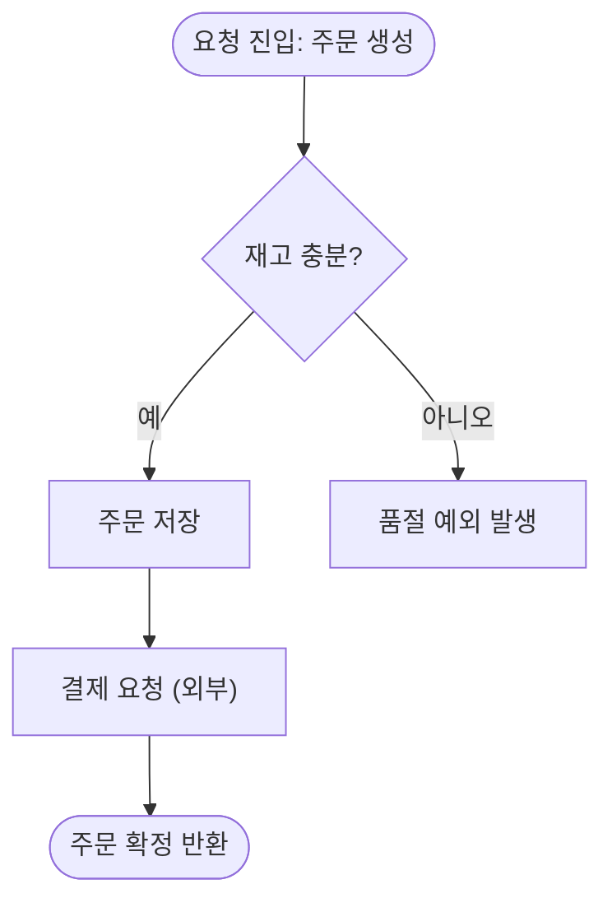

# KB: Mermaid `flowchart` 문법

제어 흐름(한 단위 내부의 분기·루프·예외)을 그릴 때 쓴다.

## 리뷰 훅 (이걸 점검하라)
- [ ] 코드블록을 ```` ```mermaid ````로 열고 `flowchart TD`(또는 `LR`)로 시작했는가 — 방향을 **하나로 고정**.
- [ ] 노드 ID가 실행 순서대로 `N1, N2, …`인가(결정론). 라벨은 따옴표로 감쌌는가(`N1["..."]`).
- [ ] 분기 노드는 `{ }`(마름모)로, 분기 엣지는 **실제 조건 라벨**(`-- "재고 부족" -->`)을 달았는가.
- [ ] 외부 시스템 호출 노드 라벨에 "(외부)"를 표시했는가.
- [ ] 모든 노드가 앵커 범례에 `파일:라인`으로 1:1 대응하는가(앵커 없는 노드 금지).
- [ ] (렌더용) `click` 지시문을 달았다면 경로가 **레포 루트 기준 상대경로**인가.

## 근거 (공식 문서 요지)

### 선언과 방향
```
flowchart TD     %% TD=위→아래, LR=좌→우, RL, BT 도 가능
```
- 흐름이 길면 `TD`, 단계가 적고 넓으면 `LR`이 읽기 좋다. 문서 전체에서 한 방향으로 고정한다.

### 노드 모양 (의미별로 일관 사용)
| 표기 | 모양 | 권장 용도 |
|------|------|-----------|
| `N1["텍스트"]` | 사각형 | 일반 처리 단계 |
| `N2{"텍스트"}` | 마름모 | 분기(조건) |
| `N3(["텍스트"])` | 스타디움 | 시작/종료(진입점·반환) |
| `N4[/"텍스트"/]` | 평행사변형 | 입력/출력 (I/O) |
| `N5[["텍스트"]]` | 서브루틴 | 다른 함수 호출(상세는 별도 다이어그램) |

### 엣지와 조건 라벨
```
N1 --> N2                  %% 단순 흐름
N2 -- "예" --> N3          %% 조건 라벨 (분기의 참)
N2 -- "아니오" --> N4       %% 조건 라벨 (분기의 거짓)
N4 -.-> N5                 %% 점선: 예외/비정상 경로 표현에 활용
```
- 분기 라벨은 **코드의 실제 조건**을 쓴다(조건식 그대로 또는 충실한 요약). 추측 라벨 금지.
- 루프는 되돌아오는 엣지로 표현: `N6 -- "남은 항목 있음" --> N3`.

### subgraph (단계 그룹화 — 가독성)
```
flowchart TD
    subgraph 검증["입력 검증"]
        N1["요청 파싱"] --> N2{"필수값 존재?"}
    end
    subgraph 처리["주문 처리"]
        N3["주문 저장"] --> N4["결제 요청 (외부)"]
    end
    N2 -- "예" --> N3
    N2 -- "아니오" --> N5["400 반환"]
```
- 단계(phase)가 3개 이상이면 subgraph로 묶어 시선 흐름을 만든다.

### click 지시문 (렌더 환경에서 노드 클릭 → 코드 이동)
```
click N1 "src/order/OrderController.kt#L42" "OrderController.kt:42"
```
- `click <노드ID> "<경로#L라인>" "<툴팁>"`. IDE·GitLab/GitHub MR·마크다운 프리뷰에서 노드가 링크가 된다.
- 터미널에서는 동작하지 않으므로 **앵커 범례표가 1차**, `click`은 보조다.

### 전체 예시 (렌더 가능)


## 작성 시 규약 (결정론 — principles §6)
- 노드 ID는 실행 순서(`N1..Nn`), 라벨은 평이한 한국어 동작 설명. 시그니처는 라벨에 박지 않고 앵커가 가리킨다.
- 분기는 항상 `{ }`, 시작/종료는 `([ ])`로 모양을 의미와 묶어 일관 적용한다.

## 인용 시
"Mermaid flowchart 문법 기준, 분기는 `{}` 마름모·조건은 엣지 라벨로 표기. 외부 호출은 라벨에 '(외부)' 명시" 식으로 근거를 단다.
