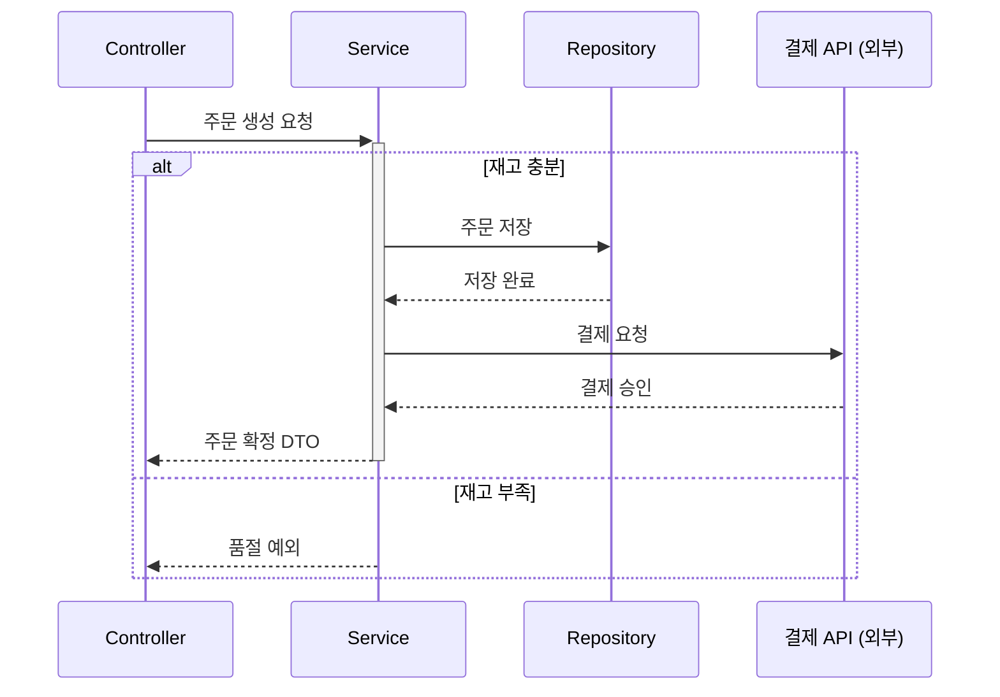

# KB: Mermaid `sequenceDiagram` 문법

컴포넌트 간 상호작용(호출 순서·동기/비동기·응답)을 그릴 때 쓴다.

## 리뷰 훅 (이걸 점검하라)
- [ ] `sequenceDiagram`으로 시작하고, 참여자를 `participant <alias> as <표시명>`으로 **먼저 선언**했는가(결정론적 순서).
- [ ] 동기 호출은 `->>`(실선 화살표), 응답은 `-->>`(점선)로 구분했는가.
- [ ] 비동기/발사 후 망각(fire-and-forget)은 `-)`로, 동기 응답 대기와 구분했는가.
- [ ] 분기·옵션·반복을 `alt`/`opt`/`loop`로 묶고 **실제 조건**을 라벨로 달았는가.
- [ ] 각 메시지(또는 참여자별 처리)가 앵커 범례에 `파일:라인`으로 대응하는가.
- [ ] 외부 시스템 참여자임을 표시명/note로 명확히 했는가.

## 근거 (공식 문서 요지)

### 참여자 선언
```
sequenceDiagram
    participant C as Controller
    participant S as Service
    participant R as Repository
    participant PAY as 결제 API (외부)
```
- `participant`로 미리 선언하면 **표시 순서가 고정**된다(선언 안 하면 등장 순서). 결정론을 위해 항상 선언한다.
- `actor C as 사용자`처럼 `actor`는 사람 행위자 표현에 쓸 수 있다.

### 메시지(화살표) 종류
| 표기 | 의미 |
|------|------|
| `C->>S: 주문 생성 요청` | 동기 호출(실선, 화살촉) |
| `S-->>C: 주문 DTO 반환` | 응답/반환(점선, 화살촉) |
| `S-)PAY: 결제 이벤트 발행` | 비동기(발사 후 비대기) |
| `S--xC: 예외 전파` | 실패/중단(점선, x) |

### activation (처리 구간 표시)
```
C->>S: createOrder()
activate S
S->>R: save(order)
R-->>S: saved
deactivate S
```
- `activate`/`deactivate`(또는 `->>+` / `-->>-` 단축)로 호출이 살아있는 구간을 막대로 보여준다 — 동기 흐름의 깊이가 한눈에 보인다.

### 제어 구조: alt / opt / loop / par
```
alt 재고 충분
    S->>R: 주문 저장
else 재고 부족
    S-->>C: 품절 예외
end
opt 쿠폰 있음
    S->>S: 할인 적용
end
loop 항목마다
    S->>R: 재고 차감
end
```
- 분기는 `alt/else`, 선택적 단계는 `opt`, 반복은 `loop`, 동시 실행은 `par`. 라벨에 **실제 조건**을 쓴다.

### note (보조 설명·경계)
```
note over PAY: 외부 시스템 — 응답 시간 추적 경계
note right of S: 트랜잭션 경계
```

### 전체 예시 (렌더 가능)


## 작성 시 규약 (결정론 — principles §6)
- 참여자 alias·표시명·순서를 고정. 메시지는 호출 순서대로. 외부 시스템은 표시명에 "(외부)" 명시.
- 앵커는 메시지 단위로 단다(예: "C->>S 호출부 = `OrderController.kt:42`"). 범례표에 메시지↔`파일:라인` 대응을 적는다.
> sequence는 노드 ID 대신 **메시지 번호(M1, M2…)**를 범례 키로 써도 좋다 — 범례에 "M1: C→S 주문 생성 = 파일:라인"으로 정리한다.

## 인용 시
"Mermaid sequence 문법 기준, 동기는 `->>`·응답은 `-->>`. 분기는 `alt/else`로 묶고 조건 라벨" 식으로 근거를 단다.
