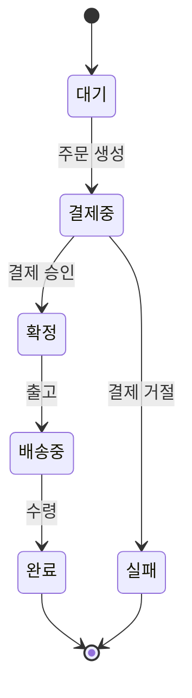

# KB: Mermaid `stateDiagram-v2` 문법

상태/수명주기 전이(상태 필드, 주문·작업이 상태를 옮겨다니는 흐름)를 그릴 때 쓴다.

## 리뷰 훅 (이걸 점검하라)
- [ ] `stateDiagram-v2`로 시작했는가(v2 권장 — 레이아웃·복합상태 우수).
- [ ] 시작은 `[*] --> 첫상태`, 종료는 `마지막상태 --> [*]`로 표기했는가.
- [ ] 전이 화살표에 **트리거(조건/이벤트)**를 라벨로 달았는가(`A --> B: 결제 승인`).
- [ ] 상태 이름이 코드의 실제 상태값(enum/상수)과 일치하는가(발명 금지).
- [ ] 각 상태(또는 전이)가 앵커 범례에 `파일:라인`으로 대응하는가(상태 정의·전이 코드 위치).

## 근거 (공식 문서 요지)

### 상태와 전이
```
stateDiagram-v2
    [*] --> 대기            %% [*] = 시작 의사상태
    대기 --> 결제중: 주문 생성
    결제중 --> 확정: 결제 승인
    결제중 --> 실패: 결제 거절
    확정 --> [*]
    실패 --> [*]
```
- `[*]`는 시작/종료 의사상태. 전이 라벨(`: 결제 승인`)에 **상태를 바꾸는 이벤트/조건**을 쓴다.

### 상태에 표시명 붙이기
```
state "결제 진행 중" as 결제중
```
- 표시명에 공백이 필요하면 `state "표시명" as alias`로 alias를 준다(코드 상태값을 alias로).

### 복합 상태 (하위 상태 묶기)
```
state 처리중 {
    [*] --> 재고확인
    재고확인 --> 저장
    저장 --> [*]
}
```
- 큰 상태 안의 하위 흐름을 중첩한다. 과하면 별도 다이어그램으로 분리(가독성).

### 분기(choice)·동시성(fork/join)
```
state 분기 <<choice>>
결제중 --> 분기
분기 --> 확정: 승인
분기 --> 실패: 거절
```
- 조건 분기는 `<<choice>>`, 병렬 상태는 `<<fork>>`/`<<join>>` 또는 `--` 구분으로 표현.

### 전체 예시 (렌더 가능)


## 작성 시 규약 (결정론 — principles §6)
- 상태 이름은 **코드의 실제 상태값**(enum 상수 등)을 따른다. 임의 상태 발명 금지.
- 전이 라벨은 코드에서 그 전이를 일으키는 지점(메서드·이벤트)을 충실히 요약하고, 그 지점을 앵커한다.
- 범례 키: 상태는 상태 정의/enum 위치, 전이는 전이를 수행하는 코드 위치를 `파일:라인`으로 적는다.

## 인용 시
"Mermaid stateDiagram-v2 기준, 시작은 `[*] --> 상태`·전이 라벨에 이벤트 표기. 상태명은 코드 enum 값과 일치" 식으로 근거를 단다.
