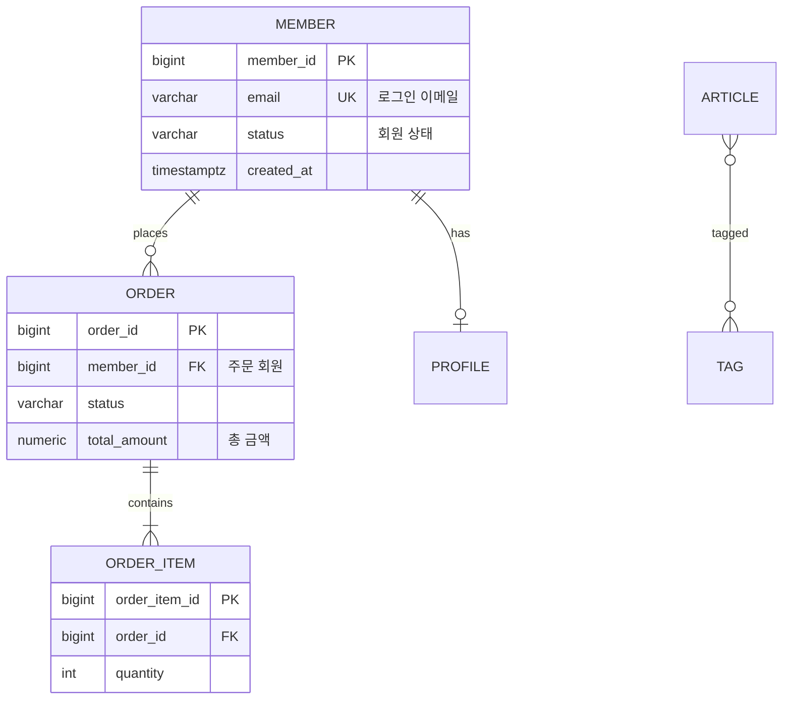

# KB: Mermaid `erDiagram` 문법

## 리뷰 훅 (이걸 점검하라)
- [ ] 코드블록을 ```` ```mermaid ````로 열고 `erDiagram`으로 시작했는가.
- [ ] 관계 줄의 카디널리티 토큰이 **양 끝 모두** 올바른가(`||`, `o{`, `|{`, `o|` 등).
- [ ] 관계에 **라벨**(`: places`)을 달았는가(렌더 시 관계 의미 표시).
- [ ] 속성 줄이 `type name KEY "comment"` 순서인가(KEY·comment는 선택).
- [ ] 키 표기를 `PK`/`FK`/`UK`로 했는가(여러 개면 `PK, FK`처럼 콤마).
- [ ] 공백/특수문자 포함 이름은 **따옴표**로 감쌌는가.
- [ ] 엔티티명 표기 규약(예: UPPER_SNAKE)을 문서 전체에서 일관 적용했는가(결정론).

## 근거 (공식 문서 요지)

### 관계 줄 문법
```
<좌엔티티> <좌카디널리티>--<우카디널리티> <우엔티티> : <라벨>
```
- 양끝 카디널리티 토큰(crow's-foot):

  | 좌(왼쪽 표기) | 우(오른쪽 표기) | 의미 |
  |----|----|------|
  | `\|\|` | `\|\|` | 정확히 1 (one and only one) |
  | `o\|` | `\|o` | 0 또는 1 (zero or one) |
  | `}\|` | `\|{` | 1 이상 (one or more) |
  | `}o` | `o{` | 0 이상 (zero or more) |

- 가운데 `--`는 **식별/비식별** 구분: 실선 `--`(식별), 점선 `..`(비식별).
- 예시 토큰 조합:
  - `MEMBER ||--o{ ORDER : places` → 회원 1 — 주문 0..N.
  - `ORDER ||--|{ ORDER_ITEM : contains` → 주문 1 — 주문항목 1..N.
  - `MEMBER ||--o| PROFILE : has` → 회원 1 — 프로필 0..1 (1:1, 선택적).
  - `ARTICLE }o--o{ TAG : tagged` → 게시글 0..N — 태그 0..N (N:M).

### 엔티티(속성) 블록
```
ENTITY_NAME {
    type attributeName KEY "comment"
}
```
- 한 줄 = `타입 이름 [키] ["주석"]`. 타입·이름 필수, 키(`PK`/`FK`/`UK`)와 주석은 선택.
- 여러 키: `bigint order_id PK, FK`.
- 이름/주석에 공백·특수문자가 있으면 따옴표로 감싼다. 주석은 항상 따옴표.

### 전체 예시 (렌더 가능)


## 작성 시 규약 (결정론 — principles §6)
- 엔티티명: **UPPER_SNAKE**로 고정(테이블명 기반). 속성명: 실제 컬럼명(snake_case) 유지.
- 관계 줄을 엔티티 블록보다 **위**에 모아 정렬(좌·우·라벨 사전순). 엔티티 블록은 테이블명 사전순.
- 타입은 마이그레이션 기준 물리 타입을 단순화해 표기(`varchar(50)`→`varchar`도 허용하되 명세 표엔 정확 타입).

## 인용 시
"Mermaid ER 문법 기준, `||--o{`는 1—0..N. nullable FK이므로 우측 `o`(선택)" 식으로 근거를 단다.
