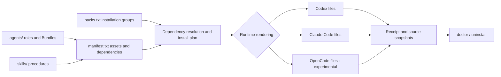
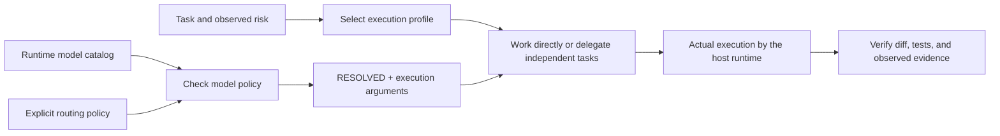

# Vulpora architecture

[한국어](architecture.ko.md) · [README](../README.md) · [Documentation index](README.md)

Vulpora maintains roles, procedures, and reference knowledge in one source catalog and installs
them in the format a coding runtime expects. The installer prepares files and dependencies; your
Codex or Claude Code runtime performs the actual work.

## Five building blocks

| Component | Responsibility | Example |
|---|---|---|
| **Agent** | Defines who makes a judgment, with which authority, inputs, outputs, and completion criteria. | [`postgres-dba.md`](../agents/postgres-dba.md): a PostgreSQL review role |
| **Skill** | Defines how to perform a task through `SKILL.md`, with optional scripts and references. | [`postgres-review-workflow`](../skills/postgres-review-workflow/SKILL.md): coordinated query, schema, and operational review |
| **Bundle** | Supplies an Agent's identity, principles, and topic-specific knowledge. Installed with the Agent. | [`agents/dba/`](../agents/dba/): `SOUL.md`, `reference/principles.md`, and `reference/kb/INDEX.md` |
| **Pack** | Selects a useful set of Agents and Skills to install together. | [`pack:postgres`](../install/packs.txt): PostgreSQL authoring and review capabilities, including dependencies |
| **MCP** | Connects the runtime to tools in an external service or database, with separate configuration and authentication. | A Notion connection or the SQL server in [`mcp/nl-sql/`](../mcp/nl-sql/) |

A workflow is a **Skill that coordinates procedures or roles**. An Agent's Bundle does not have to
share its name: `postgres-dba` uses `agents/dba/`. Tool-oriented Agents such as `test-runner` can
collect execution results without a separate judgment knowledge Bundle.

## From source to runtime



1. [`install/packs.txt`](../install/packs.txt) declares the starting assets for each Pack.
2. [`install/manifest.txt`](../install/manifest.txt) declares source paths, Bundles, dependencies,
   and destinations. Resolution follows `agent:<id>` and `skill:<id>` relationships recursively;
   cycles terminate and each asset is selected once.
3. [`install/install.sh`](../install/install.sh) builds a plan, checks for conflicts, and generates
   files for the selected runtime. Codex receives canonical Markdown together with a native TOML
   adapter. Bundle and Skill references resolve to their installed locations.
4. The installer records owned paths and snapshots in a Receipt, which supports later verification
   and removal.

For example, `pack:postgres` starts with `postgres-code-authoring` and `postgres-review-workflow`.
Their dependencies add query review, schema design, and risk-check Skills, plus the `postgres-dba`
and `data-modeling-reviewer` Agents. Packs do not maintain separate copies of the same source files.

## Repository layout

```text
vulpora/
├── vulpora                           # Primary CLI entry point
├── package.json                     # npm distribution metadata and check commands
├── agents/
│   ├── postgres-dba.md              # Canonical role definition
│   ├── postgres-dba.codex.toml      # Source Codex adapter
│   └── dba/                        # Knowledge Bundle for this role
│       ├── SOUL.md
│       └── reference/
│           ├── principles.md
│           └── kb/INDEX.md          # Entry point for task-relevant knowledge
├── skills/
│   └── start-task/
│       ├── SKILL.md                 # Task initiation and coordination procedure
│       ├── scripts/                # Validators, model/task routing, session transport
│       └── reference/              # Execution contracts and detailed knowledge
├── install/
│   ├── manifest.txt                # Canonical registry of installable assets
│   ├── packs.txt                   # 14 capability packs
│   ├── mcp-packs.txt               # Separate hosted MCP connection catalog
│   ├── install.sh                  # Resolve, render, copy, and verify
│   ├── receipt-lib.sh              # Installation ownership and snapshots
│   ├── uninstall.sh                # Receipt-based removal
│   └── test-*.sh                   # Installation, distribution, and contract checks
├── mcp/nl-sql/
│   └── src/                        # TypeScript MCP server and database drivers
├── memory/
│   ├── policies/                   # Writing, retrieval, quarantine, promotion
│   └── schemas/                    # Portable memory and evaluation contracts
├── evals/
│   ├── run-evals.sh                # Fixture and policy structure/consistency checks
│   └── behavioral/                 # Runtime adapters and behavioral evaluation
├── templates/                      # Optional commands, Git hooks, and gates
├── .claude-plugin/                 # Claude Code marketplace metadata
├── .github/workflows/              # CI and release automation
└── docs/                           # Guides, design, and evaluation evidence
```

`agents/` and `skills/` contain canonical content. `install/` manages the distribution catalog;
files generated in a user's project are installation outputs. The CLI, state paths, environment variables,
and schema IDs use the Vulpora namespace. New capabilities follow the
[authoring guide](agent-authoring-and-kb-guide.md) and [STANDARD](../STANDARD.md).

## Installed locations

| Runtime | Project Agents / Bundles | Project Skills | User scope |
|---|---|---|---|
| Codex | `.codex/agents/` | `.agents/skills/` | The same paths under `~/` |
| Claude Code | `.claude/agents/` | `.claude/skills/` | The same paths under `~/` |
| OpenCode · experimental | `.opencode/agents/` | `.opencode/skills/` | Outside the supported scope |

OpenCode project rendering is available through the lower-level
`install/install.sh --runtime opencode`. The top-level CLI supports Codex and Claude Code.

The target's `.vulpora/receipts/v1/` stores per-runtime Receipts and installation snapshots.
Separate ownership records live in a user state directory, normally `~/.local/state/vulpora/`,
with `XDG_STATE_HOME` or `VULPORA_STATE_HOME` overriding that location. Both sets of records are
checked, so creating a project-local Receipt alone does not establish removal authority. See
[`receipt-lib.sh`](../install/receipt-lib.sh) for the implementation.

## Install → run → verify → remove

Run these commands from a source checkout. Replace `/absolute/project` with an existing project
directory. For Claude Code, use `--runtime claude-code`.

```sh
# 1. Preview the installation
./vulpora setup --runtime codex --scope project --target /absolute/project --dry-run pack:core pack:orchestration

# 2. Install and verify the installed result
./vulpora setup --runtime codex --scope project --target /absolute/project pack:core pack:orchestration

# 3. Check the same configuration later
./vulpora doctor --runtime codex --scope project --target /absolute/project pack:core pack:orchestration
```

Restart the runtime after installation, then use **the conversation in your target project**:

```text
Codex:
  $vulpora-init
  $start-task "Improve search failure handling and add tests"

Claude Code:
  /vulpora-init
  /start-task "Improve search failure handling and add tests"
```

`vulpora-init` inspects the repository's stack and writes routing guidance in the managed section
of `AGENTS.md`. Optional [`vulpora.config.json`](../vulpora.config.example.json) settings control
the language and VCS policy of that guidance. They do not grant runtime sandbox or authentication
permissions.

Removal can also be previewed:

```sh
./vulpora uninstall --runtime codex --scope project --target /absolute/project --dry-run pack:orchestration
./vulpora uninstall --runtime codex --scope project --target /absolute/project pack:orchestration
```

Removal preserves user-modified files. Selective Pack removal also conservatively retains shared
dependencies needed by other installed Packs or retained standalone Agents and Skills.
**Top-level `setup` and `uninstall` apply changes unless `--dry-run` is present.** The lower-level
Shell installer and uninstaller default to dry-run and require `--apply` for changes. Installing
or removing the npm package itself does not change runtime assets. See [INSTALL](../INSTALL.md)
for complete options.

## Task execution and model selection

The execution profile selected by `start-task` and the model profile selected by `route` serve
different purposes.

| Selection | Values | Controls |
|---|---|---|
| Execution profile | `lightweight`, `standard`, `audit` | The coordination procedure and required verification evidence |
| Model profile | `frugal`, `standard`, `frontier` | Required model, reasoning level, and relative cost policy |

`lightweight` and `standard` center on the actual diff and relevant checks. `audit` uses a frozen
specification, a task dependency graph (DAG), an append-only execution ledger, and evidence for
acceptance criteria under `.vulpora/tasks/`. This audit machinery is not required for every task.
See [start-task orchestration](start-task-orchestration.md) for selection and completion contracts.



```sh
./vulpora models --runtime codex > runtime-models.json
./vulpora route --runtime codex --profile standard --catalog runtime-models.json
./vulpora route --runtime codex --task-type review --difficulty simple --catalog runtime-models.json
```

`models` reads Codex's `model/list`. `route` compares a catalog with policy and returns the model,
reasoning setting, and execution arguments as JSON. An explicit profile selects native dispatch by default;
task-type routing selects an independent session and returns `sessionArguments` instead of `nativeArguments`.
**Neither command runs a task model turn;
the routing result reports `execution: NOT_RUN`.** The host must perform the actual call and
observe its execution. Missing required models or reasoning levels produce `BLOCKED`.

Installed Codex adapters leave model and reasoning settings unpinned by default. If setup used
explicit `VULPORA_CODEX_MODEL` or `VULPORA_CODEX_REASONING_EFFORT` overrides, pass the actual
installed file to `route --agent-config /absolute/installed-agent.toml` to check for conflicts.
A placeholder model in a source adapter does not establish availability in your account. See the
[model-routing contract](../skills/start-task/reference/kb/model-routing.md) for execution boundaries.

## External tools, knowledge, and evaluation

Capability Packs install Agents and Skills. Hosted MCP connections have a separate catalog in
[`install/mcp-packs.txt`](../install/mcp-packs.txt) and lifecycle through `./vulpora mcp`.
Authentication is handled through the host runtime.

[`nl-sql`](../mcp/nl-sql/README.md) is a separate MCP server for PostgreSQL, MySQL, and SQL Server.
The calling LLM translates natural language to SQL; the server supplies schema discovery and
constrained query execution. `src/index.ts` registers tools, delegating to `tool-service.ts`, SQL
and schema policies, and database-specific drivers. Building the server, provisioning a read-only
database account, configuring the connection, and registering it with the host are separate steps.

[`memory/`](../memory/README.md) contains policies and authoring contracts for recording,
retrieving, verifying, and promoting knowledge. It does not implement a storage engine or an
automatic learning service.

| Verification layer | What it can establish |
|---|---|
| `doctor`, installation tests | Expected installation structure, Bundles, dependencies, and runtime adapters |
| `evals/run-evals.sh` | Internal consistency of fixtures and policy contracts |
| `evals/behavioral/` | Results, artifacts, and traces from a configured runtime adapter, compared with a baseline |

Installation success and passing offline checks are separate from an Agent successfully completing
a real task. See the [evaluation guide](../evals/README.md) and
[evidence trust boundaries](eval-trust-boundaries.md) for the methods and limits of that evidence.

## Independent session transport

Substantial independent lanes in standard work can use a fresh Codex process with a bounded task capsule and a
compact candidate result. Tiny tasks stay with the primary. The primary transcript is omitted from session input.
The router maps task type, difficulty, risk, budget, and the available catalog
to explicit model/effort arguments. Runtime usage is observed separately from the worker's own claims; the primary
still verifies acceptance. Raw events are discarded after extracting bounded diagnostics and usage.


See [task JSON, lifecycle, and limits](../skills/start-task/reference/kb/independent-sessions.md).
The Codex transport does not yet support Claude or native audit evidence. A separate session does not itself
create a stronger filesystem boundary or guarantee lower total token use.
The [live measurements](../evals/token-efficiency/README.md#live-independent-session-measurements) distinguish
the compact parent result from cumulative worker input and explain when session overhead is justified.
