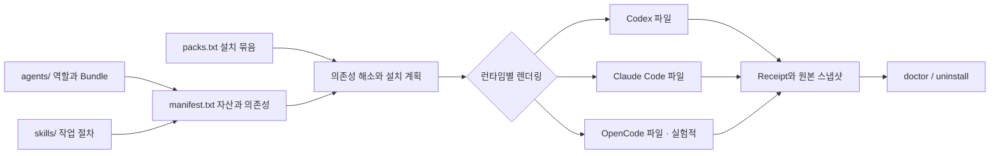
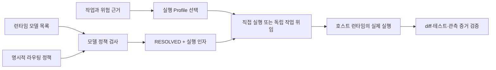

# Vulpora 아키텍처

[English](architecture.en.md) · [README](../README.ko.md) · [문서 목차](README.md)

Vulpora는 역할, 작업 절차, 참고 지식을 하나의 원본 카탈로그에서 관리하고 코딩 런타임에
맞게 설치합니다. 설치기는 필요한 파일과 의존성을 준비하고, 실제 작업은 사용 중인 Codex나
Claude Code가 실행합니다.

## 다섯 가지 구성 요소

| 구성 요소 | 역할 | 실제 예시 |
|---|---|---|
| **Agent** | 누가 어떤 책임과 권한으로 판단하는지 정의합니다. 입력, 결과 형식, 완료 기준을 포함합니다. | [`postgres-dba.md`](../agents/postgres-dba.md): PostgreSQL 전문 리뷰 역할 |
| **Skill** | 특정 작업을 어떻게 수행하는지 정의합니다. `SKILL.md`와 필요에 따른 스크립트·참고 자료를 묶습니다. | [`postgres-review-workflow`](../skills/postgres-review-workflow/SKILL.md): 쿼리·스키마·운영 위험을 종합 검토 |
| **Bundle** | Agent가 판단할 때 읽을 정체성, 원칙, 주제별 지식입니다. Agent와 함께 설치됩니다. | [`agents/dba/`](../agents/dba/): `SOUL.md`, `reference/principles.md`, `reference/kb/INDEX.md` |
| **Pack** | 함께 도입하기 좋은 Agent와 Skill을 선택한 설치 단위입니다. | [`pack:postgres`](../install/packs.txt): PostgreSQL 작성·리뷰 기능과 의존성 |
| **MCP** | 런타임이 외부 서비스나 데이터베이스에 접근할 때 호출하는 도구 연결입니다. 인증과 설정을 별도로 관리합니다. | Notion 연결, [`mcp/nl-sql/`](../mcp/nl-sql/)의 SQL 조회 서버 |

Workflow는 여러 절차나 역할을 조율하는 **Skill의 한 종류**입니다. Agent마다 Bundle 이름이
같지는 않습니다. 예를 들어 `postgres-dba`는 `agents/dba/`를 사용합니다. `test-runner`처럼
별도 판단 지식 Bundle 없이 실행·결과 수집을 담당하는 Agent도 있습니다.

## 소스에서 런타임까지



1. [`install/packs.txt`](../install/packs.txt)는 Pack별 시작 자산을 정의합니다.
2. [`install/manifest.txt`](../install/manifest.txt)는 자산의 원본 경로, Bundle, 의존성, 설치
   목적지를 정의합니다. `agent:<id>`와 `skill:<id>` 관계를 재귀적으로 해소하며, 순환 관계가
   있어도 같은 자산을 반복해서 설치하지 않습니다.
3. [`install/install.sh`](../install/install.sh)는 설치 계획을 만들고 충돌을 확인한 다음
   런타임이 읽을 파일을 생성합니다. Codex에는 canonical Markdown과 native TOML adapter를
   함께 설치하며, Bundle과 Skill 참조를 설치 경로에 맞춥니다.
4. 설치한 경로와 스냅샷을 Receipt에 기록합니다. 이후 검증과 제거에 이 정보를 사용합니다.

예를 들어 `pack:postgres`는 `postgres-code-authoring`과 `postgres-review-workflow`에서
시작하여 쿼리 리뷰, 스키마 설계, 위험 점검 Skill과 `postgres-dba`, `data-modeling-reviewer`
Agent까지 함께 설치합니다. Pack마다 같은 파일의 복사본을 따로 유지하지 않습니다.

## 폴더 구조

```text
vulpora/
├── vulpora                           # 기본 CLI 진입점
├── package.json                     # npm 배포 정보와 검증 명령
├── agents/
│   ├── postgres-dba.md              # 런타임 공통 역할 정의
│   ├── postgres-dba.codex.toml      # Codex adapter 원본
│   └── dba/                        # 이 역할의 지식 Bundle
│       ├── SOUL.md
│       └── reference/
│           ├── principles.md
│           └── kb/INDEX.md          # 질문에 맞는 지식 탐색 시작점
├── skills/
│   └── start-task/
│       ├── SKILL.md                 # 작업 시작과 조율 절차
│       ├── scripts/                # 검증기, 작업·모델 라우터, 독립 세션 실행
│       └── reference/              # 실행 계약과 상세 지식
├── install/
│   ├── manifest.txt                # 설치 가능한 모든 자산의 기준 목록
│   ├── packs.txt                   # 14개 capability pack
│   ├── mcp-packs.txt               # 별도 hosted MCP 연결 목록
│   ├── install.sh                  # 의존성 해소, 렌더링, 복사, 검증
│   ├── receipt-lib.sh              # 설치 소유권과 스냅샷 관리
│   ├── uninstall.sh                # Receipt 기준 제거
│   └── test-*.sh                   # 설치·배포·실행 계약 회귀 검사
├── mcp/nl-sql/
│   └── src/                        # TypeScript MCP 서버와 DB별 driver
├── memory/
│   ├── policies/                   # 기록, 검색, 격리, 승격 규칙
│   └── schemas/                    # 이식 가능한 memory·평가 작성 계약
├── evals/
│   ├── run-evals.sh                # fixture와 정책의 구조·정합성 검증
│   └── behavioral/                 # 런타임 adapter와 실제 행동 평가
├── templates/                      # 선택 설치하는 명령·Git hook·gate
├── .claude-plugin/                 # Claude Code marketplace 배포 메타데이터
├── .github/workflows/              # CI와 릴리스 자동화
└── docs/                           # 사용법, 설계, 평가 근거
```

`agents/`와 `skills/`가 콘텐츠 원본입니다. 배포 카탈로그는 `install/`에서 관리하고,
사용자 프로젝트에 생성된 파일은 설치 결과입니다. CLI, 내부 경로, 환경변수와 스키마 ID는
Vulpora 네임스페이스를 사용합니다. 새 기능을 만들 때에는
[저작 가이드](agent-authoring-and-kb-guide.md)와 [STANDARD](../STANDARD.md)를 따릅니다.

## 설치되는 위치

| Runtime | 프로젝트 범위 Agent / Bundle | 프로젝트 범위 Skill | 사용자 범위 |
|---|---|---|---|
| Codex | `.codex/agents/` | `.agents/skills/` | 같은 경로를 `~/` 아래에 설치 |
| Claude Code | `.claude/agents/` | `.claude/skills/` | 같은 경로를 `~/` 아래에 설치 |
| OpenCode · 실험적 | `.opencode/agents/` | `.opencode/skills/` | 지원 범위 밖 |

OpenCode는 저수준 `install/install.sh --runtime opencode`의 프로젝트 렌더링을 제공합니다.
상위 CLI에서 지원하는 설치 대상은 Codex와 Claude Code입니다.

프로젝트의 `.vulpora/receipts/v1/`에는 Runtime별 Receipt와 설치 시점의 스냅샷을 둡니다.
별도의 사용자 상태 디렉터리에도 소유권 검증용 기록을 보관합니다. 기본 위치는
`~/.local/state/vulpora/`이며, `XDG_STATE_HOME` 또는 `VULPORA_STATE_HOME` 설정에 따라
달라집니다. 두 기록을 함께 대조하므로 프로젝트 안의 Receipt만 새로 만들어 제거 권한을
주장할 수 없습니다. 자세한 동작은 [`receipt-lib.sh`](../install/receipt-lib.sh)에 있습니다.

## 설치 → 실행 → 검증 → 제거

아래 명령은 소스 checkout에서 실행합니다. `/absolute/project`는 이미 존재하는 프로젝트
경로로 바꿉니다. Claude Code를 사용한다면 `--runtime claude-code`를 지정합니다.

```sh
# 1. 설치 내용 확인
./vulpora setup --runtime codex --scope project --target /absolute/project --dry-run pack:core pack:orchestration

# 2. 설치와 설치 결과 검증
./vulpora setup --runtime codex --scope project --target /absolute/project pack:core pack:orchestration

# 3. 나중에 같은 구성 점검
./vulpora doctor --runtime codex --scope project --target /absolute/project pack:core pack:orchestration
```

설치 후 런타임을 재시작하고 **대상 프로젝트의 대화창**에서 실행합니다.

```text
Codex:
  $vulpora-init
  $start-task "검색 실패 처리를 개선하고 테스트를 추가해줘"

Claude Code:
  /vulpora-init
  /start-task "검색 실패 처리를 개선하고 테스트를 추가해줘"
```

`vulpora-init`은 저장소의 기술 스택을 읽고 `AGENTS.md`의 관리 영역에 라우팅 안내를
작성합니다. 선택적인 [`vulpora.config.json`](../vulpora.config.example.json)은 이 안내의
언어·VCS 정책을 조정합니다. 런타임의 sandbox나 인증 권한을 부여하는 설정은 아닙니다.

제거도 먼저 계획을 확인할 수 있습니다.

```sh
./vulpora uninstall --runtime codex --scope project --target /absolute/project --dry-run pack:orchestration
./vulpora uninstall --runtime codex --scope project --target /absolute/project pack:orchestration
```

사용자가 수정한 파일은 보존합니다. 선택한 Pack을 제거할 때 다른 설치 Pack이나 유지되는
개별 Agent·Skill에 필요한 공통 의존성도 보수적으로 유지합니다. **상위 CLI의 `setup`과
`uninstall`은 `--dry-run`을 생략하면 실제 반영**합니다. 저수준 Shell 설치·제거 스크립트는
반대로 기본이 dry-run이며 `--apply`가 필요합니다. npm 패키지 설치·제거 자체는 런타임
자산을 변경하지 않습니다. 자세한 옵션은 [INSTALL](../INSTALL.md)에 있습니다.

## 작업 실행과 모델 선택

`start-task`의 실행 Profile과 `route`의 모델 Profile은 서로 다른 선택입니다.

| 선택 | 값 | 결정하는 것 |
|---|---|---|
| 실행 Profile | `lightweight`, `standard`, `audit` | 조율과 검증에 필요한 절차·증거 수준 |
| 모델 Profile | `frugal`, `standard`, `frontier` | 작업에 요구되는 모델·추론 수준과 상대 비용 정책 |

`lightweight`와 `standard`는 실제 diff와 관련 검증을 중심으로 작업합니다. `audit`는
명세, 작업 의존 그래프(DAG), append-only 실행 기록(ledger), 수용 기준별 증거를 사용합니다.
해당 기록은 `.vulpora/tasks/` 아래에 만들며, 모든 작업이 이 절차를 거치는 것은 아닙니다.
선택 기준과 완료 계약은 [start-task 실행 가이드](start-task-orchestration.md)에 있습니다.



```sh
./vulpora models --runtime codex > runtime-models.json
./vulpora route --runtime codex --profile standard --catalog runtime-models.json
./vulpora route --runtime codex --task-type review --difficulty simple --catalog runtime-models.json
```

`models`는 Codex의 `model/list`를 읽습니다. `route`는 모델 목록과 정책을 대조해 사용할
모델, 추론 설정, 실행 인자를 JSON으로 출력합니다. Profile을 직접 지정하면 기본적으로 native
위임을 선택합니다. 작업 종류로 라우팅하면 독립 세션을 선택하며 `nativeArguments` 대신
`sessionArguments`를 반환합니다. **두 명령은 작업 모델 턴을
실행하지 않으며, 라우팅 결과의 실행 상태는 `execution: NOT_RUN`입니다.** 실제 호출과
실행 관측은 호스트가 수행해야 합니다. 필요한 모델이나 추론 수준을 확인할 수 없으면
`BLOCKED`로 끝납니다.

Codex adapter는 기본 설치 시 모델·추론 값을 고정하지 않습니다. 설치 시 명시한
`VULPORA_CODEX_MODEL`, `VULPORA_CODEX_REASONING_EFFORT`가 있다면 실제 설치 파일을
`route --agent-config /absolute/installed-agent.toml`로 검사해 라우팅과의 충돌을 확인합니다.
원본 adapter의 예시 모델 값을 현재 계정에서 사용할 수 있는 모델의 증거로 해석하지 않습니다.
정확한 실행 경계는 [모델 라우팅 계약](../skills/start-task/reference/kb/model-routing.md)에 있습니다.

## 외부 도구와 지식·평가의 경계

Capability Pack은 Agent와 Skill을 설치합니다. Hosted MCP 연결은
[`install/mcp-packs.txt`](../install/mcp-packs.txt)와 `./vulpora mcp` 명령에서 별도로
관리하며, 인증은 호스트 런타임을 통해 처리합니다.

[`nl-sql`](../mcp/nl-sql/README.md)은 PostgreSQL·MySQL·SQL Server용 별도 MCP 서버입니다.
호출하는 LLM이 자연어를 SQL로 바꾸고, 서버는 스키마 탐색과 제한된 조회 실행을 제공합니다.
`src/index.ts`가 도구를 등록하고 `tool-service.ts`, SQL·스키마 정책, DB별 Driver로 이어집니다.
빌드, 읽기 전용 DB 계정, 연결 설정, 호스트 등록을 별도로 준비해야 합니다.

[`memory/`](../memory/README.md)는 기억을 기록·검색·검증·승격하는 정책과 작성 계약을
담습니다. 저장 엔진이나 자동 학습 서비스가 구현되어 있다는 뜻은 아닙니다.

| 검증 계층 | 확인할 수 있는 내용 |
|---|---|
| `doctor`, 설치 테스트 | 설치 파일, Bundle, 의존성과 Runtime adapter가 기대하는 구조인지 |
| `evals/run-evals.sh` | Fixture와 정책 계약 자체의 정합성 |
| `evals/behavioral/` | 설정한 Runtime adapter를 통한 실행 결과·산출물·trace와 기준 결과 비교 |

설치 성공이나 Offline 검사 통과는 실제 에이전트의 작업 성공과 별도의 결과입니다.
평가 방법과 근거의 범위는 [평가 가이드](../evals/README.md),
[평가 증거의 신뢰 경계](eval-trust-boundaries.md)에서 확인할 수 있습니다.

## 독립 세션 실행

Standard 작업에서 분리해 실행·검증할 수 있고 충분한 작업량이 있는 부분은 새 Codex 세션에
맡길 수 있습니다. 작은 작업은 상위 세션이 직접 처리합니다. 독립 세션에는 상위 대화 전체를
넘기지 않고 범위가 정해진 작업 캡슐을 전달하며, 짧은 후보 결과를 회수합니다.

라우터는 작업 종류·난도·위험·예산과 실제 모델 목록을 대조해 모델과 추론 설정을 선택합니다.
런타임 사용량은 작업자의 자기보고와 구분해서 관측하며, 수락 조건 충족 여부는 상위 세션이
검증합니다. 원본 이벤트는 제한된 진단 정보와 사용량을 추출한 뒤 폐기합니다.


[작업 JSON·실행 주기·제한](../skills/start-task/reference/kb/independent-sessions.md)에서 구체적인
사용법을 확인할 수 있습니다. 현재 독립 세션 실행은 Codex만 지원하며, 기존 native audit 증거
경로에는 연결되지 않습니다. 새 세션이라는 사실만으로 파일 접근 경계가 강화되거나 총 토큰이
줄어드는 것은 아닙니다. [실측 결과](../evals/token-efficiency/README.ko.md#독립-세션-실측)는
부모에게 반환된 결과의 크기와 작업자의 누적 입력을 구분하고, 추가 실행 비용이 생기는 조건을 설명합니다.
