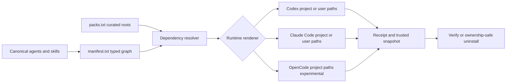

# Distribution architecture

Vulpora treats prompts and procedures as versioned installable assets. The
portable contract is the source catalog plus its dependency graph; runtime
files are rendered outputs, not additional sources of truth.

## Contracts

1. `agents/*.md` and `skills/*/SKILL.md` are canonical content. Runtime model,
   permission, and discovery metadata stay in adapters or the installer.
2. `install/manifest.txt` declares asset IDs and typed `agent:`/`skill:`
   dependencies. Resolution is recursive, cycle-safe, and identical for direct
   selectors and pack roots.
3. `install/packs.txt` is a curated convenience layer over manifest roots. It
   does not duplicate files or silently add organization policy.
4. The installer computes the complete plan before mutation, refuses symlink
   traversal and unrelated existing files, then records exact owned paths and
   snapshots. Verification renders the expected runtime form again.
5. Uninstall removes only matching receipt-owned paths. Selective pack removal
   uses the same closure and conservatively keeps dependencies required by
   other fully installed built-in packs and retained standalone agents/skills.

## Deliberate boundaries

- Built-in capability packs currently contain agent and skill roots only.
  Hosted MCP connections use `install/mcp-packs.txt`; the buildable NL-to-SQL
  server lives under `mcp/`; memory and eval assets use explicit manifest
  selectors. These lifecycles have different trust and credential boundaries.
- Codex and Claude Code are stable installer targets. OpenCode project-scope
  rendering is experimental until native discovery and execution smoke tests
  are part of the release evidence.
- `vulpora.config.json` controls only generated repository routing policy. It
  does not override host sandbox, approval, credential, or MCP trust policy.
- npm lifecycle scripts never install or remove runtime assets. Mutation needs
  an explicit CLI command and is recoverable through receipts while snapshots
  remain valid.

## Adding a capability

1. Add one canonical agent or skill with bounded responsibility and portable
   references. Add a Codex adapter for each agent; the same metadata also feeds
   OpenCode rendering.
2. Register it and every typed dependency in `install/manifest.txt`. Add a pack
   root only when it is a useful, accurately named adoption unit.
3. Add structural, behavioral, install, and removal tests appropriate to its
   authority and side effects. Runtime execution evidence is separate from a
   successful package or copy test.
4. Update the catalog documentation and run the contribution and public-release
   gates. External content must carry provenance and redistribution rights.

Compatibility-sensitive identifiers include the `vulpora` CLI, environment
variables, receipt directories, and schema IDs. A project rename should keep
aliases for these identifiers through an announced major-version migration.
