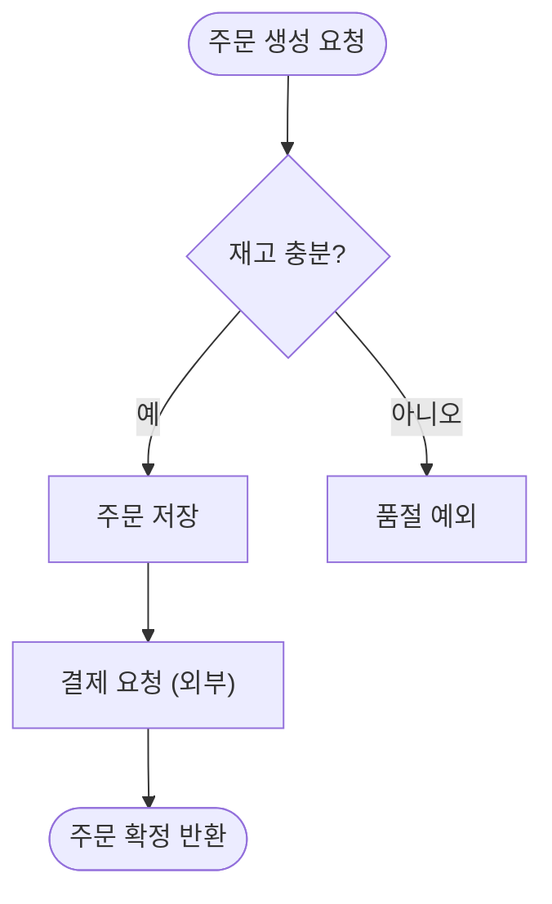

# Code Diagram Extract

특정 코드의 동작을 **읽기 쉬운 다이어그램 + `파일:라인` 앵커**로 만드는 절차 스킬. `code-cartographer`
에이전트가 "무엇을·어떤 형식으로" 낼지 결정하면, 이 스킬은 "**어떻게 추적하고 어떻게 앵커를 다는가**"를 담는다.
문법·가독성 근거는 에이전트 번들 KB(`mermaid-*-syntax`, `diagram-readability`)에, 추적·앵커링 절차는
이 스킬의 [principles](reference/principles.md)와 [KB index](reference/kb/INDEX.md)에 있다.
INDEX에서 현재 작업에 맞는 topic만 읽고 `reference/kb/` 전체를 재귀 로드하지 않는다.

> **언어·프레임워크 무관(MUST)**: 어떤 언어의 어떤 코드든(함수·스크립트·프론트엔드 컴포넌트·CLI·백엔드·데이터 파이프라인)
> 동일하게 적용한다. 특정 스택(예: Java/Spring)에 한정하지 않는다 — 아래 예시는 설명용일 뿐 모든 언어에 같은 절차를 쓴다.

> **두 가지가 항상 성패를 가른다(사용자 요구)**: ① **가독성** — 정확해도 안 읽히면 실패. ② **코드로 바로 이동** —
> 모든 노드는 실제 `파일:라인`을 가리키고, 터미널에서 클릭하면 그 라인으로 간다. 앵커 없는 노드는 그리지 않는다.

## 핵심 원칙 (먼저)
- **정적 추적만** — 프로그램을 실행하지 않는다. 읽은 라인에만 근거한다(`reference/principles.md`).
- **발명 금지** — 코드에 있는 흐름만 그린다. 동적 디스패치로 대상이 불확실하면 호출부를 앵커하고 "추정"으로 표시.
- **타입은 동작이 정한다** — 제어흐름→flowchart, 상호작용→sequence, 상태전이→state.

## 절차 (이 순서로 진행)

### 1) 대상·경계 확정
- 진입점(함수/메서드/핸들러/흐름)과 **멈출 경계**를 정한다. 경계 후보: 호출자 스코프 끝, I/O 엣지, 외부 시스템.
- `Glob`/`Grep`로 진입점과 그것이 부르는 심볼을 찾는다. 사용자 요청이 모호하면 **고른 경계를 명시**한다.

### 2) 다이어그램 타입 선택 (KB: behavior-to-diagram-type)
- 한 단위 내부의 분기·루프·예외가 핵심 → **flowchart**.
- 여러 컴포넌트의 호출 순서·동기/비동기가 핵심 → **sequenceDiagram**.
- 상태값이 단계를 옮겨다니는 게 핵심 → **stateDiagram-v2**.
- 1차 타입 하나를 고른다. 두 관점이 진짜 필요하면 작은 다이어그램 2장.

### 3) 정적 추적 (KB: static-tracing-method)
- 진입점부터 **실행 순서대로** 따라간다: 호출 → 분기(조건) → 루프 → early-return → 예외 경로.
- 각 의미 있는 단계마다 기록: 짧은 라벨(평이한 동작 설명), `파일:라인`, 분기 조건(있으면), 대상 확실/추정 여부.
- 트리비얼 글루(단순 getter·매핑·로깅)는 부모 단계에 흡수. 노드 예산(≤20, 상한 25) 안에서 추상화 수준을 맞춘다.

### 4) 앵커 수집 (KB: code-anchoring-fileline)
- 앵커는 **반드시 읽은 라인**이어야 한다. Read로 실제 라인 번호를 확인하고 적는다(추측 라인 금지).
- 경로는 **레포 루트 기준 상대경로**, 백틱으로 감싼다(`src/order/OrderService.kt:88`) — 터미널 클릭 인식.
- 동적 디스패치: 호출부를 앵커하고, 가능한 구현 후보를 노트에 "추정"으로.

### 5) 다이어그램 작성 (KB: 에이전트 번들 mermaid-* + diagram-readability)
- 노드 ID는 실행 순서(`N1..Nn`), 방향(`TD`/`LR`) 고정, 분기 엣지에 실제 조건 라벨, 단계는 subgraph로 그룹화.
- 가독성 리뷰 훅으로 자기 점검(노드 수·라벨·교차·앵커 누락).

### 6) 산출 (3단 구조 고정)
1. **다이어그램**(Mermaid)
2. **앵커 범례표**: `| 노드 | 코드 위치 (클릭하여 이동) | 설명 |` — 모든 노드 1:1 대응
3. **노트**: 추정/동적 디스패치·추적 경계·미해결
- (선택) 렌더 환경용 Mermaid `click` 지시문 추가.
- 기본은 응답에 인라인. 파일로 원하면 **대상 흐름에서 파생한 슬러그**로 저장한다(예: `docs/flows/handler-run.md`, `docs/flows/order-create.md`). **`flow.md` 같은 고정명 금지** — 사용자가 여러 흐름을 그리면 덮어쓰기 때문이다(대상마다 고유 파일).

## 산출 예시 (요약)
````markdown


| 노드 | 코드 위치 (클릭하여 이동) | 설명 |
|------|--------------------------|------|
| N1 | `src/order/OrderController.kt:42` | 주문 생성 진입점 |
| N2 | `src/order/OrderService.kt:88` | 재고 검증 분기 |
| N3 | `src/order/OrderService.kt:103` | 주문 저장 |
| N4 | `src/order/OrderService.kt:91` | 재고 부족 예외 |
| N5 | `src/payment/PaymentClient.kt:55` | 외부 결제 호출 (구현 런타임 결정 — 호출부 앵커) |
| N6 | `src/order/OrderService.kt:120` | 확정 주문 반환 |

> 노트: N5는 `PaymentClient` 인터페이스 호출 — 실제 구현은 주입 빈에 따라 다름(추정). 추적 경계: 외부 결제 API.
````

## 금기
- 프로그램 실행·디버거·런타임 트레이스 금지(정적 소스만).
- 읽지 않은 라인 앵커 금지, 코드에 없는 흐름 발명 금지.
- 코드 검토·비판 금지(동작 시각화만). 우려는 노트에 사실로만.
- 비밀/PII 값 전사 금지(마스킹).
