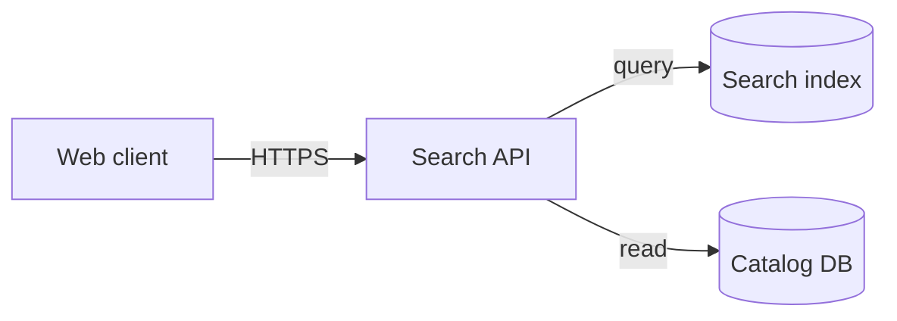

# Simple Architecture Authoring

Use `flowchart LR` or `flowchart TD` for a small component topology. This is a C4-like overview, not a precise deployment drawing.

- Choose one abstraction level and state it in the surrounding document.
- Label edges with protocol or responsibility only when it adds information.
- Use subgraphs only for real trust, ownership, or deployment boundaries.
- Do not invent services to balance the layout.
- Keep to 9 nodes and 12 edges. Route larger or brand-precise maps to an SVG/HTML architecture renderer.
