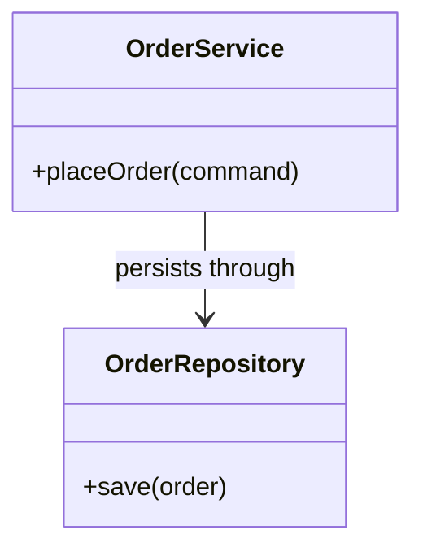

# Class Diagram Authoring

Use `classDiagram` for software types, owned operations, inheritance, composition, and aggregation.

- Show only members needed for the design question.
- Distinguish inheritance, composition, aggregation, and dependency accurately.
- Avoid turning every source file into a class node.
- Keep to 7 classes, 8 relationships, and 5 members per class by default.
