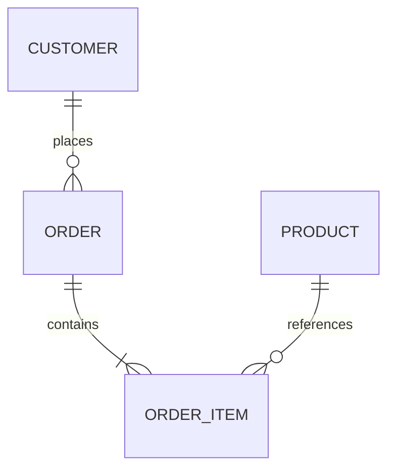

# ER Diagram Authoring

Use `erDiagram` for domain entities and cardinality, not physical storage tuning.

- Use domain names and explicit cardinality at both ends.
- Add only key attributes needed to explain the relationship.
- Do not invent fields, keys, nullability, or constraints absent from evidence.
- Keep to 8 entities and 12 relationships by default.
