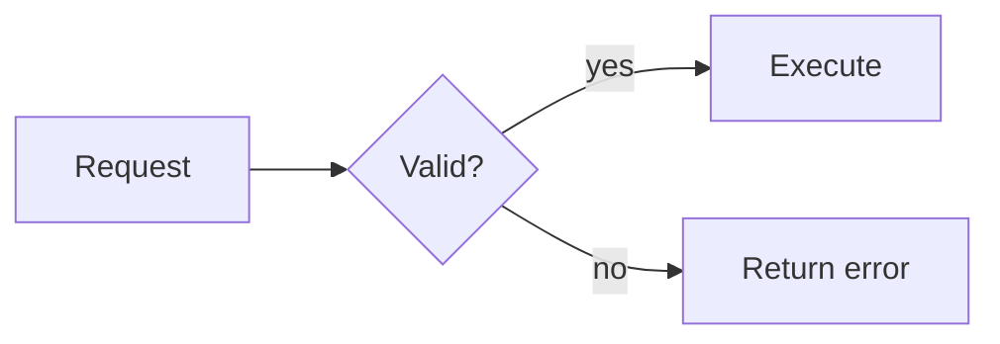

# Flowchart Authoring

Use `flowchart LR` for pipelines and `flowchart TD` for decision trees. Model actions as nodes and outcomes as labeled edges.

- Give every decision at least two explicit outcomes.
- Prefer one entry and clearly recognizable terminal outcomes.
- Do not use color as the only success/failure signal.
- Keep to 9 nodes and 12 edges by default; split nested subprocesses into detail diagrams.
