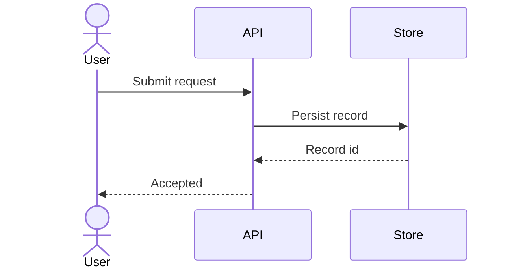

# Sequence Diagram Authoring

Use `sequenceDiagram` when ordering and actor responsibility matter.

- Order participants from initiator to deepest dependency.
- Use solid arrows for calls and dashed arrows for replies.
- Name business messages, not implementation trivia.
- Use at most 5 participants, 12 messages, and one shallow `alt`, `opt`, or `loop` fragment by default.
