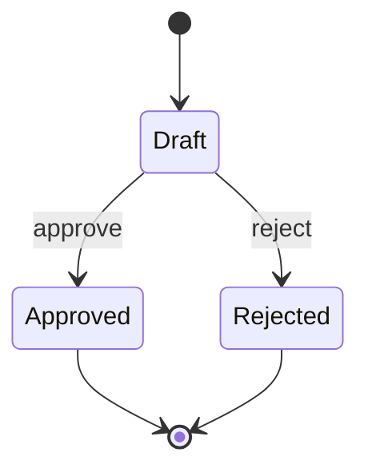

# State Diagram Authoring

Use `stateDiagram-v2` for lifecycle states and guarded transitions.

- Name states with durable conditions and transitions with events or guards.
- Include meaningful initial and terminal states when the lifecycle has them.
- Do not model ordinary procedural steps as states.
- Keep to 9 states and 12 transitions by default.
