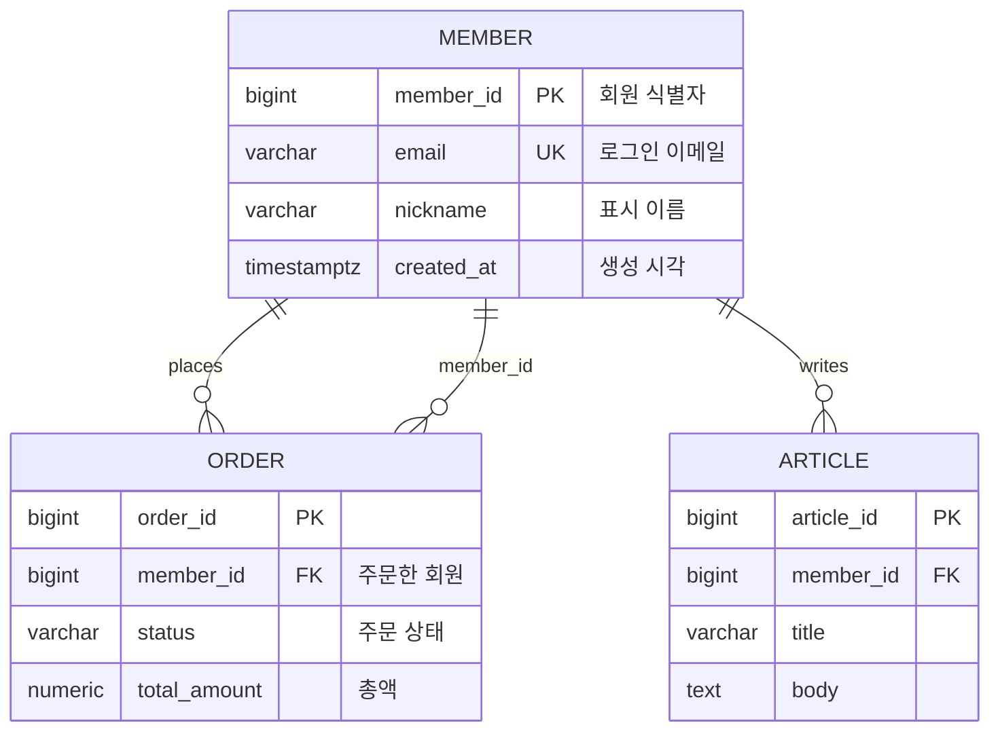

# KB: Mermaid erDiagram 문법

> Mermaid `erDiagram`은 엔티티-관계 다이어그램을 텍스트로 선언한다(공식 문서). 코드펜스 \```mermaid 안에 둔다.

## 기본 구조
```
erDiagram
    ENTITY_A ||--o{ ENTITY_B : "관계라벨"
    ENTITY_A {
        타입 컬럼명 키 "코멘트"
    }
```
- 첫 줄은 반드시 `erDiagram`.
- 엔티티 이름은 대문자/스네이크 권장(공백 포함 시 따옴표). 관계 라인 → 엔티티 속성 블록 순으로 쓴다.

## 관계 문법 (crow's-foot)
```
<좌엔티티> <좌카디널리티>--<우카디널리티> <우엔티티> : <라벨>
```
관계는 `--`(실선, 식별) 또는 `..`(점선, 비식별)로 잇는다.

### 카디널리티 토큰
| 토큰 | 의미 | 읽기 |
|------|------|------|
| `|o` / `o|` | 0 또는 1 | Zero or one |
| `||` | 정확히 1 | Exactly one |
| `}o` / `o{` | 0 이상 | Zero or more |
| `}|` / `|{` | 1 이상 | One or more |

- 좌/우 양끝에 토큰을 붙인다. 예: `ORDER }o--|| MEMBER` = 주문 N개 ↔ 회원 정확히 1.
- 스키마 추출 규칙: FK 컬럼이 **NOT NULL이면 `||`(1)**, **NULL 허용이면 `o|`/`|o`(0..1)**. 자식 측은 보통 `}o`(0..N).

## 속성(컬럼) 블록
```
ENTITY {
    type name keys "comment"
}
```
- `keys`는 `PK`, `FK`, `UK`를 공백으로 조합(`PK`, `FK`, `PK,FK` 등). 코멘트는 따옴표.
- 타입은 자유 문자열(물리 타입 그대로: `bigint`, `varchar`, `timestamptz`).

## 완전한 동작 예시 (그대로 렌더됨)


## 흔한 파싱 실패
- 첫 줄 `erDiagram` 누락, 관계 토큰 좌우 비대칭(`||--` 한쪽만), 속성 블록 밖에 컬럼 선언.
- 엔티티명에 공백·하이픈을 따옴표 없이 사용. 코멘트 따옴표 누락.

## 리뷰 훅
- [ ] 첫 줄이 `erDiagram`이고 \```mermaid 코드펜스 안에 있는가.
- [ ] 모든 관계 라인의 카디널리티 토큰이 좌우 모두 유효한가(`||`,`|o`,`o{`,`}|` 등).
- [ ] FK NULL 여부에 맞춰 1 vs 0..1 카디널리티를 정했는가.
- [ ] 모든 테이블이 엔티티 블록으로 존재하는가(고립 테이블 포함).
- [ ] 키 표기(`PK`/`FK`/`UK`)가 실제 제약과 일치하는가.
- [ ] 근거(FK/명시적 연관) 없는 관계선을 넣지 않았는가.
