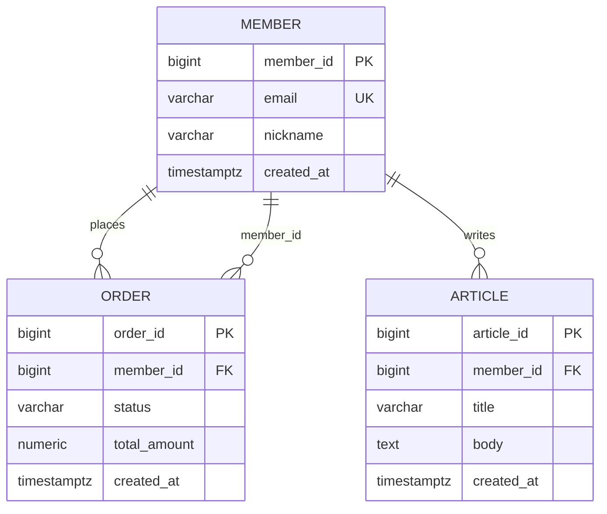

# Schema documentation output examples

Read when a concrete output example is needed. The per-schema output and drift rules remain in
[SKILL.md](../SKILL.md); examples are illustrative and do not replace repository evidence.

## OUTPUT EXAMPLE — erd.md (actually-rendered Mermaid)
````markdown
# ERD

> 생성: schema-doc-extract / 입력: Flyway 마이그레이션 + 엔티티 코드 (정적)


````

## OUTPUT EXAMPLE — tables/_index.md (schema index)
```markdown
# 테이블 명세 — 스키마 인덱스

> 생성: schema-doc-extract / 입력: Flyway 마이그레이션 + 엔티티 코드 (정적)
> 테이블 명세는 스키마별 파일로 분리되어 있다. ERD 전체는 [../erd.md](../erd.md).

| 스키마 | 테이블 수 | 명세 파일 |
|--------|-----------|-----------|
| public | 2 | [public.md](public.md) |
| order  | 1 | [order.md](order.md) |

**전역 drift 요약**: 검출 2건 (public 1, order 1) — 상세는 각 스키마 파일의 `## Drift`.
```

## OUTPUT EXAMPLE — tables/public.md (per-schema specification)
```markdown
# public 스키마 — 테이블 명세

> 생성: schema-doc-extract / 입력: Flyway 마이그레이션 + 엔티티 코드 (정적)

## public.member — 회원
| 컬럼 | 타입 | NULL | 기본값 | 키 | 설명 |
|------|------|------|--------|----|------|
| member_id | bigint | NO | nextval | PK | 회원 식별자 |
| email | varchar(255) | NO |  | UK | 로그인 이메일 |
| nickname | varchar(50) | NO |  |  | 표시 이름 |
| created_at | timestamptz | NO | now() |  | 생성 시각 |

- **인덱스**: `uq_member_email (email) UNIQUE`
- **제약**: `pk_member PRIMARY KEY (member_id)`
- **관계**: `member 1 — N order.order (order.member_id)`

## Drift (코드 ↔ 마이그레이션 불일치 — public 한정)
- `member.deleted_at`: 엔티티에는 있으나 마이그레이션에 없음 → 물리 미반영(마이그레이션 우선).
- (불일치 없음이면) "검출된 drift 없음" 명시.
```

> `tables/order.md` follows the same format and contains only the `order` schema's tables. Don't mix tables of another schema into one schema file.
